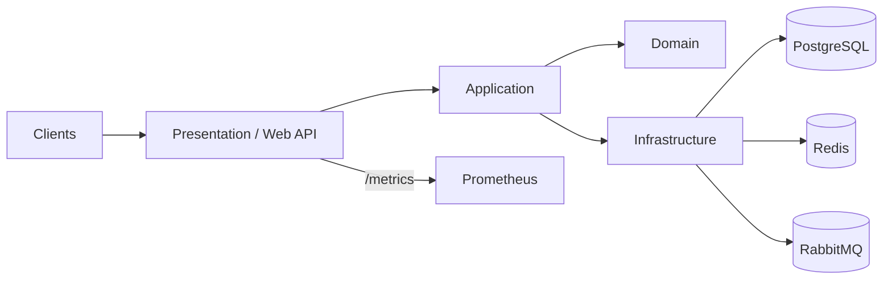
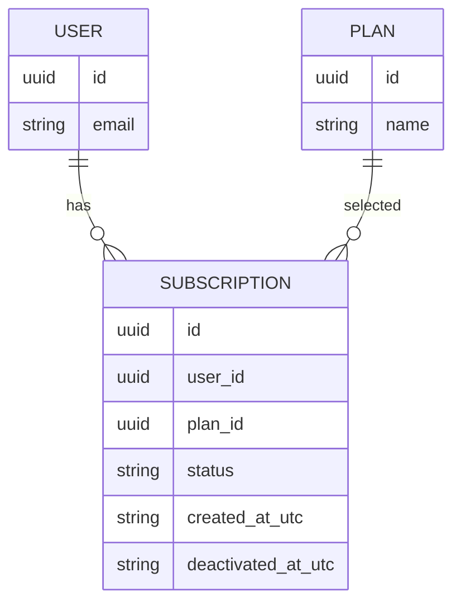

# Subscription Management

A sample subscription/billing backend showcasing Clean Architecture (.NET), CQRS, and production-grade primitives.

---

## 2) Architecture at a Glance (Clean Architecture)

**Presentation:** Middlewares (ExceptionHandler/ProblemDetails) → Correlation → SecurityHeaders → RateLimiter → CORS → AuthN → AuthZ → MapControllers, API Versioning, Swagger  
**Application:** CQRS (MediatR), Validators, Mappers, Policies  
**Domain:** Entities/ValueObjects/DomainEvents, invariants *(One Active per User)*  
**Infrastructure:** EF Core (Npgsql), Idempotency, Outbox (BackgroundService), Redis, OTEL Exporters, *(MassTransit‑ready)*

---

## 5) Domain Model & Invariants

**Active uniqueness (chosen):** A user may have **at most one** *Active* subscription at a time.  
**DB constraint (example):**
- Partial unique index on `(user_id)` where `status = 'Active'`.
- `status ∈ { Active, Inactive, Cancelled }` enforced at the application layer.

---

## Local Development (quick)
- PostgreSQL, Redis, RabbitMQ (optional) via Docker Compose
- EF Core migrations + Outbox pattern
- Observability via OTEL + Prometheus

---

## License
MIT
