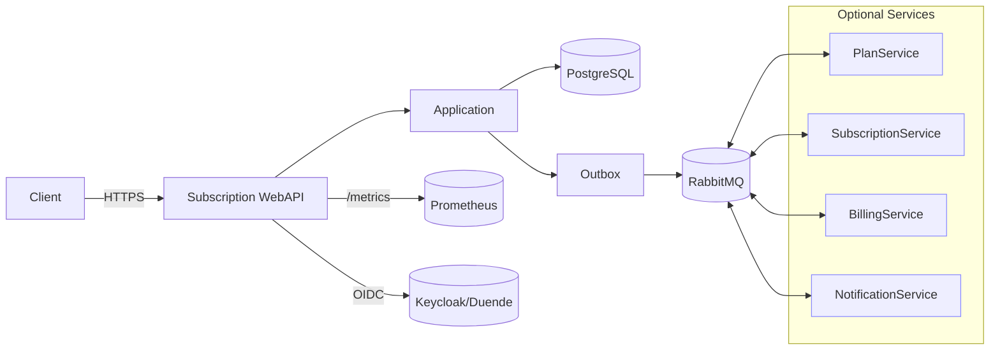
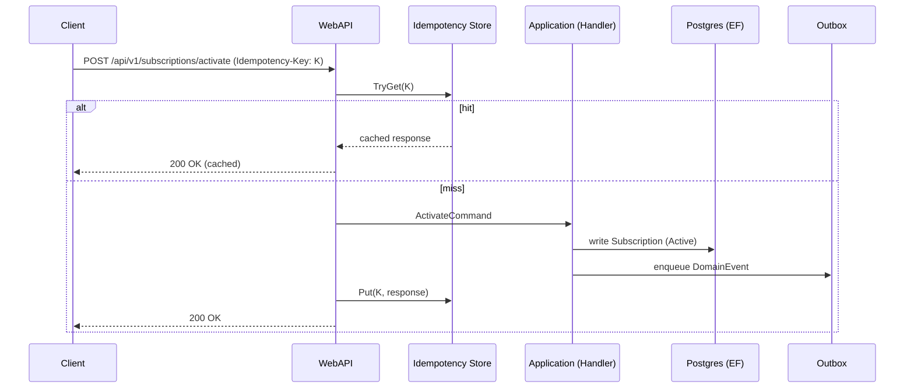
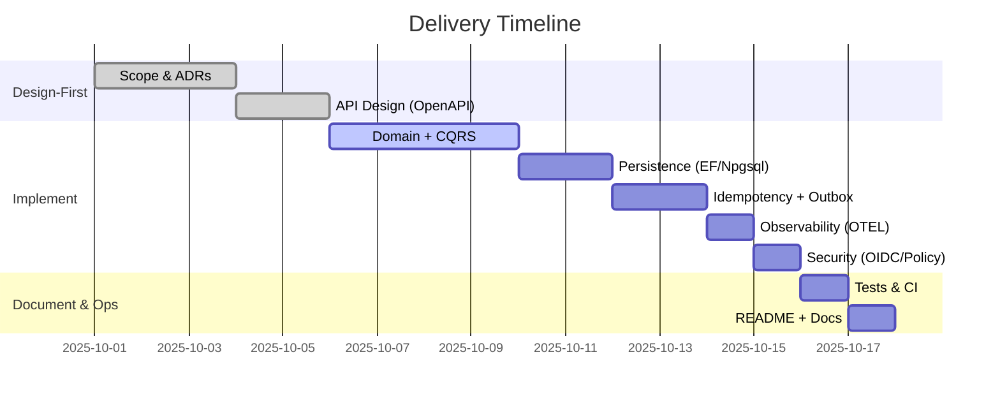

Here’s a **complete, professional, and very detailed README** for your repo—organized into **20 numbered sections** and packed with diagrams, tables, and hands-on commands. It’s written as if someone has **zero context**, so they can go from 0 → 100 confidently.

> Replace `OWNER/REPO` with your repo path (e.g. `yasserebrahimi/SubscriptionManagement`) where noted.

---

# Subscription Management

<p align="center">
  <a href="https://github.com/OWNER/REPO/actions/workflows/ci.yml">
    
  </a>
  <a href="https://github.com/OWNER/REPO/actions/workflows/trivy.yml">
    
  </a>
  <a href="https://app.codecov.io/gh/OWNER/REPO">
    
  </a>
  <a href="https://sonarcloud.io/project/overview?id=OWNER_REPO">
    
  </a>
  
  
  
  
</p>

---

## 1) TL;DR

A production-grade **.NET 8** backend demonstrating:

* **Clean Architecture** (Domain / Application / Infrastructure / Presentation)
* **CQRS (MediatR), FluentValidation, AutoMapper**
* **EF Core + PostgreSQL**, **Idempotency Store** + **Outbox** (reliable async)
* **OpenTelemetry** traces/metrics + **/metrics** (Prometheus)
* **API Versioning**, **Swagger**, **RFC7807** errors
* **JWT/OIDC**, **Policy-based auth**, **Rate limiting**, **Security headers**, **Correlation-ID**
* Ready for **microservices split** (Plan/Subscription/Billing/Notification)
* **CI/CD**: GitHub Actions, **SonarCloud**, **Codecov**, **Trivy**, **GHCR**, **Helm**, **Terraform**

---

## 2) Architecture at a Glance (Clean Architecture)

```mermaid
flowchart LR
  UI[Clients] --> P[Presentation (WebAPI)]
  P --> A[Application]
  A --> D[Domain]
  A --> I[Infrastructure]
  I --> DB[(PostgreSQL)]
  I --> Cache[(Redis)]
  I --> Bus[(RabbitMQ)]
  P -->|/metrics| Prometheus[(Prometheus)]
```

**Presentation**: Middlewares (ExceptionHandler/ProblemDetails → Correlation → SecurityHeaders → RateLimiter → CORS → AuthN → AuthZ → MapControllers), API Versioning, Swagger
**Application**: CQRS (MediatR), Validators, Mappers, Policies
**Domain**: Entities/ValueObjects/DomainEvents, invariants (**One Active per User**)
**Infrastructure**: EF Core (Npgsql), Idempotency, Outbox (BackgroundService), Redis, OTEL Exporters, (MassTransit-ready)

---

## 3) Services & Microservices Plan

Current delivery is a **modular monolith** (one WebAPI). It’s designed to split into microservices with minimal churn:

* **Subscription WebAPI** *(current)*: API gateway for plans/subscriptions
* **PlanService** *(planned)*: plan catalog & pricing
* **SubscriptionService** *(planned)*: lifecycle, invariants (Active uniqueness)
* **BillingService** *(planned)*: invoicing/payments
* **NotificationService** *(planned)*: email/SMS
* **IdentityProvider** *(external)*: Keycloak/Duende



---

## 4) Project Structure (Tree)

```
src/
  Core/Domain/...
  Core/Application/...
  Infrastructure/...
  Presentation/WebAPI/Program.cs
tests/
  UnitTests/...
  IntegrationTests.Containerized/...
  ContractTests.Pact/...
docs/
  Architecture/*  Domain/*  API/*  Security/*  Operations/*  Deployment/*  DB/*  Testing/*
scripts/
  sql/init_operational.sql  sql/add-unique-active-index.sql
deploy/
  helm/subscription-webapi/*        # chart
infra/
  terraform/main.tf                 # skeleton
.github/workflows/
  ci.yml  codeql.yml  codecov.yml  trivy.yml  docker-publish.yml  sonar.yml  release-drafter.yml
```

---

## 5) Domain Model & Invariants

```mermaid
erDiagram
  USER ||--o{ SUBSCRIPTION : has
  PLAN ||--o{ SUBSCRIPTION : selected
  SUBSCRIPTION {
    uuid id PK
    uuid user_id
    uuid plan_id
    string status  // Active, Inactive, Cancelled
    timestamp created_at_utc
    timestamp? deactivated_at_utc
  }
```

**Active uniqueness (Option A – chosen)**: a user may have **at most one Active** subscription at a time.
**DB constraint**:

```sql
CREATE UNIQUE INDEX IF NOT EXISTS ux_subscriptions_user_active
ON subscriptions (user_id)
WHERE status = 'Active';
```

*(Option B – per-plan variant is documented in `docs/DB/ActiveUniqueness.md`.)*

---

## 6) Use-Cases (Sequence)



---

## 7) Prerequisites

* **.NET SDK 8.x**
* **Docker Desktop** (Postgres, optional Prometheus/RabbitMQ)
* **PowerShell 7+** (Windows) / **bash** (Linux/macOS)
* Optional: **k6**, **Helm**, **Terraform**, **Keycloak/Duende**

---

## 8) Quickstart (Local)

```bash
# 1) bring up infra
docker compose up -d

# 2) apply operational tables (if not via migrations)
psql "Host=localhost;Port=5432;Database=subscriptiondb;Username=dev;Password=dev" -f scripts/sql/init_operational.sql

# 3) run the API
dotnet run --project src/Presentation/WebAPI/SubscriptionManagement.WebAPI.csproj

# 4) open:
# Swagger:  http://localhost:5080/swagger
# Health:   http://localhost:5080/health
# Metrics:  http://localhost:5080/metrics
```

---

## 9) Configuration (.env)

```dotenv
ConnectionStrings__Postgres=Host=localhost;Port=5432;Database=subscriptiondb;Username=dev;Password=dev
OIDC__Authority=https://keycloak.example.com/realms/yourrealm   # optional for dev
OIDC__Audience=subscription-api
IDEMPOTENCY__TTL_HOURS=24
```

> **Placeholders** → replace `OWNER/REPO` safely in README:

* PowerShell (correct way):

  ```powershell
  $c = Get-Content -Raw README.md
  $c = $c -replace 'OWNER/REPO','yasserebrahimi/SubscriptionManagement'
  $c = $c -replace 'OWNER_REPO','yasserebrahimi_SubscriptionManagement'
  Set-Content README.md $c -Encoding UTF8
  ```
* bash:

  ```bash
  sed -i 's|OWNER/REPO|yasserebrahimi/SubscriptionManagement|g; s|OWNER_REPO|yasserebrahimi_SubscriptionManagement|g' README.md
  ```

---

## 10) API Surface (v1)

**Base**: `http://localhost:5080`

| Method | Path                             | Description             | Auth/Policy                         |
| -----: | -------------------------------- | ----------------------- | ----------------------------------- |
|    GET | /api/v1/plans                    | List plans              | (optional) `plans:read`             |
|   POST | /api/v1/subscriptions/activate   | Activate subscription   | `subscriptions:write` + Idempotency |
|   POST | /api/v1/subscriptions/deactivate | Deactivate subscription | `subscriptions:write`               |
|    GET | /api/v1/subscriptions/{id}       | Get subscription by id  | `subscriptions:read`                |

**Errors (RFC7807)**: 400/401/404/409/429 with `application/problem+json` and examples wired in Swagger.

---

## 11) Security (JWT/OIDC, Policies, Headers, CORS, Rate-Limiter)

* **OIDC/JWT**: set `OIDC__Authority`, `OIDC__Audience`.
* **Policies**: e.g. `SubscriptionsWrite` → claim `scope=subscriptions:write`.
* **Security headers**: no-sniff, X-Frame-Options, basic XSS hardening.
* **CORS**: permissive in dev; lock down in prod.
* **Rate limiting**: sliding window (e.g., 200 req/min). On exceed → **429** with RFC7807 + headers.
* **Correlation-ID**: `X-Correlation-ID` generated if missing; logged & returned.

---

## 12) Resilience (Polly) & External Calls

HttpClient policies for external dependencies (e.g., Payment Gateway):

* **Retry**: exponential backoff (200ms * 2^n) × 5, handles **429**
* **Circuit Breaker**: opens after 5 failures for 30s
* **Timeout**: 3s policy (HttpClient 5s)
* **Bulkhead**: 20 concurrent, queue 40

> Snippet is in `src/Presentation/WebAPI/_snippets/Program.Merge.Additions.cs.txt`.

---

## 13) Idempotency Store (Write Safety)

* Header: `Idempotency-Key` (ASCII ≤ 128).
* **Scope**: per-user per endpoint.
* **Behavior**: replay with same key returns the **exact same body & status**.
* **Conflict**: same key with **different payload** → **409 Conflict**.
* **TTL**: default 24h (configurable via `IDEMPOTENCY__TTL_HOURS`).
* Stored in Postgres with expiry index.

---

## 14) Outbox (Reliable Async)

* Domain events persisted with the write transaction.
* Background worker **publishes** events to the bus (MassTransit/RabbitMQ) or invokes integration hooks.
* Prevents lost messages and makes **microservice split** easier.

---

## 15) Observability (OpenTelemetry, Prometheus)

* Built-in ASP.NET Core + HttpClient + runtime/process instruments.
* **/metrics** endpoint for Prometheus scraping.
* Suggested **SLIs/SLOs**:

  * **Availability**: 99.9%
  * **Latency**: p95 < 300ms, p99 < 800ms
  * **Error budget**: 0.1% / month

**PromQL Cheat-Sheet**

```
# RPS
sum(rate(http_server_request_duration_seconds_count[5m]))

# Latency p95
histogram_quantile(0.95, sum(rate(http_server_request_duration_seconds_bucket[5m])) by (le))

# Error rate
sum(rate(http_server_request_duration_seconds_count{status=~"5.."}[5m])) /
sum(rate(http_server_request_duration_seconds_count[5m]))
```

---

## 16) Testing (Unit, Integration, Contract, Performance)

* **Unit**: `tests/UnitTests/*` (Domain + Application)
* **Integration (Testcontainers)**: `tests/IntegrationTests.Containerized/*`

  ```bash
  dotnet test tests/IntegrationTests.Containerized -c Release
  ```
* **Contract (Pact)**: `tests/ContractTests.Pact/*` → pact files for provider verification

  ```bash
  dotnet test tests/ContractTests.Pact -c Release
  ```
* **Performance (k6)**: `tests/Perf/k6/activate-smoke.js`

  ```bash
  k6 run tests/Perf/k6/activate-smoke.js
  # or BASE_URL=http://localhost:5080 k6 run ...
  ```

---

## 17) CI/CD (GitHub Actions, Quality Gates)

Workflows (`.github/workflows`):

* `ci.yml` — restore/build/test
* `codecov.yml` — uploads coverage (**CODECOV_TOKEN**)
* `sonar.yml` — SonarCloud (**SONAR_TOKEN**)
* `trivy.yml` — container image scan
* `docker-publish.yml` — build & push image to **GHCR**
* `codeql.yml`, `dependency-review.yml`, `release-drafter.yml`

**Badges** (top of README) point to `OWNER/REPO`.
**Recommended gates**: build green, coverage ≥ **70%**, Sonar **Quality Gate: Passed**, Trivy **no Critical**.

---

## 18) Deployment (Compose, Helm, Terraform)

**Local (compose)**:

```bash
docker compose up -d
dotnet run --project src/Presentation/WebAPI/SubscriptionManagement.WebAPI.csproj
```

**Helm (Kubernetes)**:

```bash
helm upgrade --install subscription-webapi deploy/helm/subscription-webapi -n subscription --create-namespace \
  --set image.repository=ghcr.io/OWNER/REPO-webapi \
  --set image.tag=latest
```

**Terraform (skeleton)**:

* `infra/terraform/main.tf` with `kubeconfig_path`, `kube_context`, `namespace`.

---

## 19) Troubleshooting & Runbooks

* **DB connection failed** → check `docker ps`, connection string, port 5432
* **401 Unauthorized** → supply JWT or relax OIDC for dev
* **429 Too Many Requests** → rate limiter triggered; retry later
* **Idempotency didn’t replay** → verify header + `idempotency_keys` table
* **/metrics missing** → ensure OTEL exporter and Development profile

**Operational steps**

1. Check `/health` and recent deployment.
2. Inspect `/metrics` → RPS, latency, 5xx.
3. Correlate logs via `X-Correlation-ID`.
4. Verify DB and Message Bus health.
5. Roll back or reduce traffic if p95 > SLO.

---

## 20) Roadmap, Contribution, Support

**Roadmap**

* Extract **PlanService** as first microservice (HTTP + Pact provider; Helm subchart)
* Wire **MassTransit** end-to-end (Outbox → publish → consumer)
* Add **/ready** probe (readiness) for external deps
* Advanced Grafana dashboards for **SLI/SLO** drill-downs

**Contribute**

```bash
git checkout -b feat/your-feature
dotnet test
# open PR with description, logs, screenshots
```

**Security**
See `SECURITY.md` (responsible disclosure). Update the contact email.

**License**
Add your LICENSE file or Apache-2.0/MIT as appropriate.

---

### Appendix A — Timeline (Design → Implement → Document)



---

### Appendix B — Swagger Error Shapes (RFC7807)

Global **OperationFilter** adds example bodies for 400/401/404/409/429 under `application/problem+json`. See:

* `src/Presentation/WebAPI/Swagger/ProblemDetailsResponsesOperationFilter.cs`
* `src/Presentation/WebAPI/Swagger/ProblemDetailsExampleFactory.cs`

---

If you want, I can **package this README as a file** and also update your **docs/** map accordingly; or even inject your actual **OWNER/REPO** in the content and return a ready-to-commit zip.
