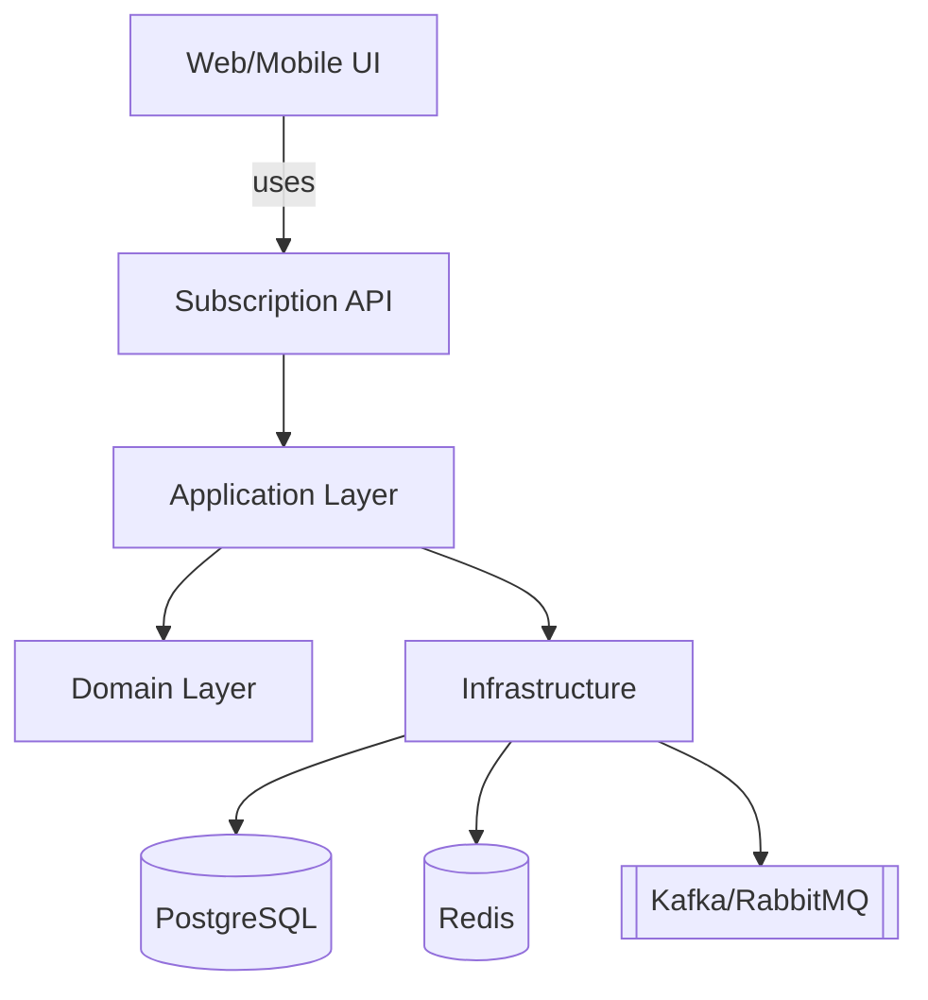
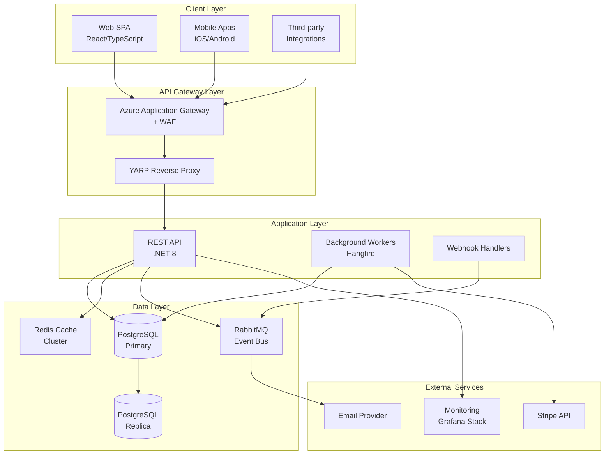
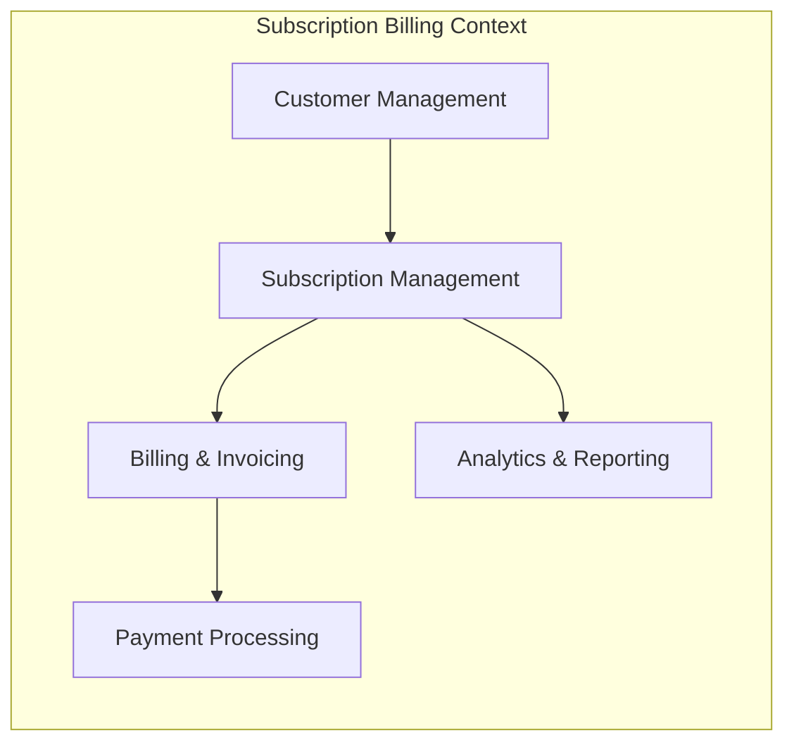
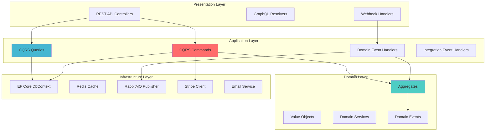

> Written with [StackEdit](https://sta# Subscription Management System
## Comprehensive Technical Architecture Document
**Version:** 1.0.0
**Status:** ✅ Complete
**Last Updated:** 2025-10-23
**Author:** Yasser Ebrahimi Fard
**Classification:** Internal - Technical Documentation

---

## Document Purpose
This document provides a **production-ready technical architecture** for a modern subscription management system built with **.NET 8**, **PostgreSQL**, and **Azure Kubernetes Service (AKS)**. It serves as the single source of truth for:

- System design and architectural decisions
- Implementation guidelines and best practices
- Operational runbooks and incident response
- Technology roadmap and future enhancements
- Risk assessment and mitigation strategies

**Target Audience:** Engineering teams, technical leadership, DevOps engineers, and stakeholders involved in building and operating the subscription platform.

**Document Scope:** End-to-end architecture covering domain modeling, API design, infrastructure, security, observability, testing, and operations.

---

# Table of Contents
1. [Comprehensive Technical Architecture Document](#comprehensive-technical-architecture-document)
2. [Document Purpose](#document-purpose)
3. [1. System Overview & Context](#1-system-overview--context)
4. [2. Domain Model (Domain-Driven Design)](#2-domain-model-domain-driven-design)
5. [3. API Design & Interface Contracts](#3-api-design--interface-contracts)
6. [4. Data Architecture & Storage](#4-data-architecture--storage)
7. [5. Application Architecture](#5-application-architecture)
8. [6. Infrastructure & Deployment](#6-infrastructure--deployment)
9. [7. Reliability & SRE](#7-reliability--site-reliability-engineering)
10. [8. Security & Compliance](#8-security--compliance)
11. [9. Observability](#9-observability)
12. [10. Developer Experience (CI/CD)](#10-developer-experience-cicd)
13. [11. Infrastructure Deep Dive](#11-infrastructure-deep-dive)
14. [12. Testing Strategy](#12-testing-strategy)
15. [13. Operations & Runbooks](#13-operations--runbooks)
16. [14. Technology Roadmap](#14-technology-roadmap)
17. [15. Risks & Trade-offs](#15-risks--trade-offs)
18. [16. Appendix](#16-appendix)
19. [Document Metadata](#document-metadata)
20. [Acknowledgments](#acknowledgments)

---

## 1. System Overview & Context
### 1.1 Executive Summary
The **Subscription Management System** is a cloud-native, production-grade platform designed to handle recurring billing, subscription lifecycle management, and revenue operations at scale. Built on **.NET 8** and **Azure Kubernetes Service (AKS)**, it supports:

- **10,000+ active subscriptions** with SLA-backed reliability
- **99.9% uptime** (43.2 minutes downtime/month)
- **1500 requests per second** (RPS) sustained throughput
- **Multi-currency support** for global operations
- **PCI-DSS compliant** payment processing via Stripe

**Key Capabilities:**
- Flexible subscription plans (monthly, annual, usage-based)
- Automated billing and invoice generation
- Proration calculations for mid-cycle changes
- Failed payment retry and dunning management
- Real-time webhook notifications
- Comprehensive analytics and reporting

### 1.2 Business Context
**Problem Statement:**
Modern SaaS businesses need robust subscription infrastructure to:
- Reduce revenue leakage from failed payments
- Automate complex billing scenarios (upgrades, downgrades, proration)
- Provide self-service customer portals
- Scale from 100 to 100,000+ customers without re-architecture

**Target Market:**
- B2B SaaS companies (\$10M-\$100M ARR)
- Platform businesses with usage-based pricing
- API-first products requiring white-label billing

**Success Metrics:**
- Reduce involuntary churn by 40% (via dunning)
- Decrease manual billing operations by 80%
- Support 5x growth without infrastructure changes
- Achieve <5% MRR churn rate

### 1.3 System Context Diagram


### 1.4 Key Architectural Drivers
| Driver | Requirement | Impact |
| --- | --- | --- |
| **Scalability** | Support 1500 RPS, 10k concurrent users | Horizontal scaling, caching strategy |
| **Reliability** | 99.9% uptime SLO | Circuit breakers, retries, redundancy |
| **Security** | PCI-DSS, GDPR compliance | Encryption, audit logging, data residency |
| **Maintainability** | <30min mean time to recovery | Observability, automated rollback |
| **Performance** | API latency <500ms (P95) | DB indexing, CDN, Redis caching |
| **Extensibility** | New payment methods in <2 weeks | Plugin architecture, webhooks |

### 1.5 Constraints & Assumptions
**Technical Constraints:**
- Must use .NET 8 LTS (company standard)
- Azure cloud only (existing enterprise agreement)
- PostgreSQL for relational data (team expertise)
- Kubernetes for orchestration (existing infrastructure)

**Business Constraints:**
- Budget: \$150k/year infrastructure + \$1.3M personnel
- Timeline: MVP in 6 months, GA in 9 months
- Team: 5-9 engineers (current availability)

**Assumptions:**
- Average subscription value: \$50-\$500/month
- 80% credit card, 20% ACH/wire payments
- 95% of traffic from North America/Europe
- English-only UI in MVP (i18n later)

### 1.6 High-Level Architecture


### 1.7 Technology Stack Summary
| Layer | Technology | Version | Purpose |
| --- | --- | --- | --- |
| **Runtime** | .NET | 8.0 LTS | Application framework |
| **API Framework** | ASP.NET Core | 8.0 | REST API, Minimal APIs |
| **Database** | PostgreSQL | 16.x | Primary data store |
| **Cache** | Redis | 7.x | Distributed caching |
| **Message Bus** | RabbitMQ | 3.12.x | Event-driven messaging |
| **Container** | Docker | 24.x | Application packaging |
| **Orchestration** | Kubernetes (AKS) | 1.28.x | Container orchestration |
| **IaC** | Terraform | 1.6.x | Infrastructure provisioning |
| **CI/CD** | GitHub Actions | — | Build and deployment |
| **Monitoring** | Grafana + Prometheus | — | Observability |
| **Logging** | Serilog + Loki | — | Structured logging |
| **Tracing** | OpenTelemetry | 1.7.x | Distributed tracing |
| **Payments** | Stripe | API v2023-10 | Payment processing |

### 1.8 Non-Functional Requirements
**Performance:**
- API Response Time: P95 <500ms, P99 <1000ms
- Database Query Time: P95 <100ms
- Cache Hit Rate: >80%
- Throughput: 1500 RPS sustained, 3000 RPS peak

**Reliability:**
- Availability: 99.9% uptime (43.2 min/month downtime)
- Error Rate: <0.1% for API requests
- Data Durability: 99.999999999% (11 nines)
- RTO: <1 hour, RPO: <5 minutes

**Security:**
- Authentication: OAuth 2.0 + OIDC
- Data Encryption: AES-256 at rest, TLS 1.3 in transit
- Audit Logging: All data modifications logged
- Penetration Testing: Quarterly
- Compliance: PCI-DSS Level 1, GDPR, SOC 2 Type II (roadmap)

**Scalability:**
- Auto-scale 2–20 pods
- Read replicas for scaling reads
- Redis cluster with 3 shards
- Multi-region support (roadmap)

**Maintainability:**
- Code Coverage: >85% unit tests
- Deployment Frequency: Daily (blue-green)
- MTTR: <30 minutes
- API docs auto-generated (Swagger)

## 2. Domain Model (Domain-Driven Design)
### 2.1 Bounded Context
The system is organized into a single **Subscription Billing** bounded context with clear sub-domains:


**Context Mapping:**
- **Core Domain:** Subscription lifecycle, billing logic (custom-built)
- **Supporting Domain:** Customer management, analytics (custom-built)
- **Generic Domain:** Payment processing (Stripe integration)

### 2.2 Core Aggregates
#### 2.2.1 Subscription Aggregate
**Aggregate Root:** `Subscription`

```csharp
// Domain/Aggregates/Subscription.cs
public class Subscription : AggregateRoot
{
    public Guid Id { get; private set; }
    public Guid CustomerId { get; private set; }
    public string PlanId { get; private set; }
    public SubscriptionStatus Status { get; private set; }
    public decimal Amount { get; private set; }
    public string Currency { get; private set; }
    public BillingInterval Interval { get; private set; }

    // Billing cycle tracking
    public DateTime CurrentPeriodStart { get; private set; }
    public DateTime CurrentPeriodEnd { get; private set; }
    public DateTime? CancelAt { get; private set; }
    public DateTime? CancelledAt { get; private set; }

    // Trial management
    public DateTime? TrialStart { get; private set; }
    public DateTime? TrialEnd { get; private set; }

    // Payment tracking
    public string? PaymentMethodId { get; private set; }
    public DateTime? NextBillingDate { get; private set; }

    // Metadata
    public DateTime CreatedAt { get; private set; }
    public DateTime UpdatedAt { get; private set; }
    public string CreatedBy { get; private set; }

    // Business logic
    public void Activate(DateTime startDate)
    {
        if (Status != SubscriptionStatus.PendingActivation)
            throw new InvalidOperationException("Can only activate pending subscriptions");

        Status = SubscriptionStatus.Active;
        CurrentPeriodStart = startDate;
        CurrentPeriodEnd = CalculatePeriodEnd(startDate, Interval);
        NextBillingDate = CurrentPeriodEnd;
        UpdatedAt = DateTime.UtcNow;

        AddDomainEvent(new SubscriptionActivatedEvent(Id, CustomerId, startDate));
    }

    public void Cancel(DateTime? cancelAt = null, string? reason = null)
    {
        if (Status == SubscriptionStatus.Cancelled)
            throw new InvalidOperationException("Subscription already cancelled");

        if (cancelAt.HasValue)
        {
            // Schedule cancellation
            CancelAt = cancelAt.Value;
            Status = SubscriptionStatus.PendingCancellation;
        }
        else
        {
            // Immediate cancellation
            Status = SubscriptionStatus.Cancelled;
            CancelledAt = DateTime.UtcNow;
        }

        UpdatedAt = DateTime.UtcNow;
        AddDomainEvent(new SubscriptionCancelledEvent(Id, CustomerId, reason));
    }

    public ProrationResult ChangePlan(string newPlanId, decimal newAmount, DateTime effectiveDate)
    {
        if (Status != SubscriptionStatus.Active)
            throw new InvalidOperationException("Can only change plan for active subscriptions");

        // Calculate proration
        var daysRemaining = (CurrentPeriodEnd - effectiveDate).Days;
        var totalDays = (CurrentPeriodEnd - CurrentPeriodStart).Days;
        var unusedAmount = (Amount / totalDays) * daysRemaining;
        var newPeriodAmount = (newAmount / totalDays) * daysRemaining;
        var prorationAmount = newPeriodAmount - unusedAmount;

        var oldPlanId = PlanId;
        PlanId = newPlanId;
        Amount = newAmount;
        UpdatedAt = DateTime.UtcNow;

        AddDomainEvent(new SubscriptionPlanChangedEvent(Id, oldPlanId, newPlanId, prorationAmount));

        return new ProrationResult
        {
            ProrationAmount = prorationAmount,
            UnusedAmount = unusedAmount,
            NewPeriodAmount = newPeriodAmount,
            EffectiveDate = effectiveDate
        };
    }

    public void Renew()
    {
        if (Status != SubscriptionStatus.Active && Status != SubscriptionStatus.PastDue)
            throw new InvalidOperationException("Cannot renew non-active subscription");

        CurrentPeriodStart = CurrentPeriodEnd;
        CurrentPeriodEnd = CalculatePeriodEnd(CurrentPeriodStart, Interval);
        NextBillingDate = CurrentPeriodEnd;
        UpdatedAt = DateTime.UtcNow;

        AddDomainEvent(new SubscriptionRenewedEvent(Id, CurrentPeriodStart, CurrentPeriodEnd));
    }

    public void MarkPastDue()
    {
        if (Status != SubscriptionStatus.Active) return;
        Status = SubscriptionStatus.PastDue;
        UpdatedAt = DateTime.UtcNow;
        AddDomainEvent(new SubscriptionMarkedPastDueEvent(Id, CustomerId));
    }

    private DateTime CalculatePeriodEnd(DateTime start, BillingInterval interval)
    {
        return interval switch
        {
            BillingInterval.Monthly => start.AddMonths(1),
            BillingInterval.Quarterly => start.AddMonths(3),
            BillingInterval.SemiAnnually => start.AddMonths(6),
            BillingInterval.Annually => start.AddYears(1),
            _ => throw new ArgumentException("Invalid billing interval")
        };
    }
}

public enum SubscriptionStatus
{
    PendingActivation,
    Active,
    PastDue,
    Cancelled,
    PendingCancellation,
    Trialing,
    Paused
}

public enum BillingInterval
{
    Monthly,
    Quarterly,
    SemiAnnually,
    Annually
}
```

**Invariants:**
- Subscription must have valid customer and plan
- Active subscriptions must have future billing date
- Cannot change plan if past due
- Cannot activate cancelled subscription

#### 2.2.2 Customer Aggregate
```csharp
// Domain/Aggregates/Customer.cs
public class Customer : AggregateRoot
{
    public Guid Id { get; private set; }
    public string Email { get; private set; }
    public string Name { get; private set; }
    public string? CompanyName { get; private set; }
    public Address? BillingAddress { get; private set; }
    public CustomerStatus Status { get; private set; }

    // Payment methods
    private readonly List<PaymentMethod> _paymentMethods = new();
    public IReadOnlyList<PaymentMethod> PaymentMethods => _paymentMethods.AsReadOnly();
    public string? DefaultPaymentMethodId { get; private set; }

    // Stripe integration
    public string? StripeCustomerId { get; private set; }

    // Metadata
    public DateTime CreatedAt { get; private set; }
    public DateTime UpdatedAt { get; private set; }

    public void AddPaymentMethod(PaymentMethod paymentMethod, bool setAsDefault = false)
    {
        if (_paymentMethods.Any(pm => pm.Id == paymentMethod.Id))
            throw new InvalidOperationException("Payment method already exists");

        _paymentMethods.Add(paymentMethod);

        if (setAsDefault || DefaultPaymentMethodId == null)
        {
            DefaultPaymentMethodId = paymentMethod.Id;
        }

        UpdatedAt = DateTime.UtcNow;
        AddDomainEvent(new PaymentMethodAddedEvent(Id, paymentMethod.Id, setAsDefault));
    }

    public void UpdateBillingAddress(Address newAddress)
    {
        BillingAddress = newAddress;
        UpdatedAt = DateTime.UtcNow;
        AddDomainEvent(new CustomerBillingAddressUpdatedEvent(Id, newAddress));
    }

    public void Deactivate()
    {
        Status = CustomerStatus.Inactive;
        UpdatedAt = DateTime.UtcNow;
        AddDomainEvent(new CustomerDeactivatedEvent(Id));
    }
}

public class Address : ValueObject
{
    public string Line1 { get; private set; }
    public string? Line2 { get; private set; }
    public string City { get; private set; }
    public string State { get; private set; }
    public string PostalCode { get; private set; }
    public string Country { get; private set; }

    protected override IEnumerable<object> GetEqualityComponents()
    {
        yield return Line1;
        yield return Line2 ?? string.Empty;
        yield return City;
        yield return State;
        yield return PostalCode;
        yield return Country;
    }
}

public class PaymentMethod : Entity
{
    public string Id { get; private set; }
    public PaymentMethodType Type { get; private set; }
    public string Last4 { get; private set; }
    public string? Brand { get; private set; }
    public int? ExpiryMonth { get; private set; }
    public int? ExpiryYear { get; private set; }
    public bool IsDefault { get; private set; }
    public DateTime CreatedAt { get; private set; }
}
```

#### 2.2.3 Invoice Aggregate
```csharp
// Domain/Aggregates/Invoice.cs
public class Invoice : AggregateRoot
{
    public Guid Id { get; private set; }
    public string InvoiceNumber { get; private set; }
    public Guid CustomerId { get; private set; }
    public Guid SubscriptionId { get; private set; }
    public InvoiceStatus Status { get; private set; }

    // Amounts (stored in cents)
    public decimal Subtotal { get; private set; }
    public decimal Tax { get; private set; }
    public decimal Discount { get; private set; }
    public decimal Total { get; private set; }
    public string Currency { get; private set; }

    // Line items
    private readonly List<InvoiceLineItem> _lineItems = new();
    public IReadOnlyList<InvoiceLineItem> LineItems => _lineItems.AsReadOnly();

    // Payment tracking
    public DateTime? PaidAt { get; private set; }
    public string? PaymentIntentId { get; private set; }
    public DateTime? DueDate { get; private set; }

    // Dunning
    public int AttemptCount { get; private set; }
    public DateTime? NextRetryAt { get; private set; }

    public DateTime CreatedAt { get; private set; }
    public DateTime UpdatedAt { get; private set; }

    public void AddLineItem(InvoiceLineItem item)
    {
        _lineItems.add(item);
        RecalculateTotals();
    }

    public void MarkAsPaid(string paymentIntentId, DateTime paidAt)
    {
        if (Status == InvoiceStatus.Paid)
            throw new InvalidOperationException("Invoice already paid");

        Status = InvoiceStatus.Paid;
        PaymentIntentId = paymentIntentId;
        PaidAt = paidAt;
        UpdatedAt = DateTime.UtcNow;

        AddDomainEvent(new InvoicePaidEvent(Id, CustomerId, Total, paidAt));
    }

    public void MarkAsPaymentFailed(string reason)
    {
        Status = InvoiceStatus.PaymentFailed;
        AttemptCount++;

        // Exponential backoff: 1 day, 3 days, 7 days, 14 days
        var daysToWait = AttemptCount switch
        {
            1 => 1,
            2 => 3,
            3 => 7,
            _ => 14
        };

        NextRetryAt = DateTime.UtcNow.AddDays(daysToWait);
        UpdatedAt = DateTime.UtcNow;

        AddDomainEvent(new InvoicePaymentFailedEvent(Id, CustomerId, reason, AttemptCount));
    }

    private void RecalculateTotals()
    {
        Subtotal = _lineItems.Sum(li => li.Amount);
        Total = Subtotal + Tax - Discount;
    }
}

public class InvoiceLineItem : Entity
{
    public Guid Id { get; private set; }
    public string Description { get; private set; }
    public decimal Quantity { get; private set; }
    public decimal UnitPrice { get; private set; }
    public decimal Amount { get; private set; }
    public DateTime PeriodStart { get; private set; }
    public DateTime PeriodEnd { get; private set; }
}

public enum InvoiceStatus
{
    Draft,
    Open,
    Paid,
    Void,
    Uncollectible,
    PaymentFailed
}
```

### 2.3 Domain Events
```csharp
// Domain/Events/SubscriptionEvents.cs
public record SubscriptionCreatedEvent(Guid SubscriptionId, Guid CustomerId, string PlanId, decimal Amount, DateTime CreatedAt) : IDomainEvent;
public record SubscriptionActivatedEvent(Guid SubscriptionId, Guid CustomerId, DateTime ActivatedAt) : IDomainEvent;
public record SubscriptionCancelledEvent(Guid SubscriptionId, Guid CustomerId, string? Reason) : IDomainEvent;
public record SubscriptionPlanChangedEvent(Guid SubscriptionId, string OldPlanId, string NewPlanId, decimal ProrationAmount) : IDomainEvent;
public record SubscriptionRenewedEvent(Guid SubscriptionId, DateTime PeriodStart, DateTime PeriodEnd) : IDomainEvent;
public record InvoicePaidEvent(Guid InvoiceId, Guid CustomerId, decimal Amount, DateTime PaidAt) : IDomainEvent;
public record InvoicePaymentFailedEvent(Guid InvoiceId, Guid CustomerId, string Reason, int AttemptCount) : IDomainEvent;
```

### 2.4 Value Objects
```csharp
// Domain/ValueObjects/Money.cs
public class Money : ValueObject
{
    public decimal Amount { get; private set; }
    public string Currency { get; private set; }

    public Money(decimal amount, string currency)
    {
        if (amount < 0) throw new ArgumentException("Amount cannot be negative");
        if (string.IsNullOrWhiteSpace(currency) || currency.Length != 3)
            throw new ArgumentException("Currency must be 3-letter ISO code");
        Amount = amount;
        Currency = currency.ToUpperInvariant();
    }

    public Money Add(Money other)
    {
        if (Currency != other.Currency)
            throw new InvalidOperationException("Cannot add money with different currencies");
        return new Money(Amount + other.Amount, Currency);
    }

    public Money Multiply(decimal factor) => new Money(Amount * factor, Currency);

    protected override IEnumerable<object> GetEqualityComponents()
    {
        yield return Amount;
        yield return Currency;
    }
}
```

```csharp
// Domain/ValueObjects/EmailAddress.cs
public class EmailAddress : ValueObject
{
    public string Value { get; private set; }

    public EmailAddress(string value)
    {
        if (string.IsNullOrWhiteSpace(value))
            throw new ArgumentException("Email cannot be empty");
        if (!IsValidEmail(value))
            throw new ArgumentException("Invalid email format");
        Value = value.ToLowerInvariant();
    }

    private static bool IsValidEmail(string email) =>
        System.Text.RegularExpressions.Regex.IsMatch(email, @"^[^@\s]+@[^@\s]+\.[^@\s]+$");

    protected override IEnumerable<object> GetEqualityComponents() { yield return Value; }
}
```

### 2.5 Domain Services
```csharp
// Domain/Services/ProrationCalculator.cs
public interface IProrationCalculator
{
    ProrationResult Calculate(Subscription subscription, string newPlanId, decimal newAmount, DateTime effectiveDate);
}

public class ProrationCalculator : IProrationCalculator
{
    public ProrationResult Calculate(Subscription subscription, string newPlanId, decimal newAmount, DateTime effectiveDate)
    {
        var currentPeriodDays = (subscription.CurrentPeriodEnd - subscription.CurrentPeriodStart).Days;
        var remainingDays = (subscription.CurrentPeriodEnd - effectiveDate).Days;
        if (remainingDays <= 0) throw new InvalidOperationException("Effective date must be before period end");

        var dailyRateOld = subscription.Amount / currentPeriodDays;
        var dailyRateNew = newAmount / currentPeriodDays;

        var unusedCredit = dailyRateOld * remainingDays;
        var newCharge = dailyRateNew * remainingDays;
        var prorationAmount = newCharge - unusedCredit;

        return new ProrationResult
        {
            ProrationAmount = Math.Round(prorationAmount, 2),
            UnusedAmount = Math.Round(unusedCredit, 2),
            NewPeriodAmount = Math.Round(newCharge, 2),
            EffectiveDate = effectiveDate
        };
    }
}

public class ProrationResult
{
    public decimal ProrationAmount { get; init; }
    public decimal UnusedAmount { get; init; }
    public decimal NewPeriodAmount { get; init; }
    public DateTime EffectiveDate { get; init; }
}
```

### 2.6 Ubiquitous Language Dictionary
| Term | Definition | Example |
| --- | --- | --- |
| **Subscription** | Recurring billing agreement between customer and service | Monthly SaaS license |
| **Plan** | Template defining price, interval, and features | "Pro Plan: \$99/month" |
| **Billing Cycle** | Period between invoice generations | 1st of month to last day |
| **Proration** | Proportional billing adjustment for mid-cycle changes | Upgrade on day 15 of 30-day cycle |
| **Dunning** | Process of retrying failed payments | Retry after 1, 3, 7 days |
| **Churn** | Customer cancellation rate | 5% monthly churn = 95% retention |
| **MRR** | Monthly Recurring Revenue | Sum of all active subscription amounts |
| **ARR** | Annual Recurring Revenue | MRR × 12 |
| **LTV** | Customer Lifetime Value | Avg revenue over customer lifespan |
| **Trial** | Free period before first charge | 14-day free trial |
| **Grace Period** | Days allowed after failed payment before cancellation | 7-day grace period |

## 3. API Design & Interface Contracts
### 3.1 API Design Principles
**RESTful Standards:**
- Resource-oriented URLs (`/subscriptions/{id}`)
- HTTP verbs map to CRUD (GET, POST, PUT, DELETE)
- Stateless request handling
- HATEOAS links (optional)

**Versioning Strategy:**
- URL path: `/api/v1/subscriptions`
- Header: `X-API-Version: 1`
- Deprecation: 6 months notice, 12 months support

**Pagination:**
- Cursor-based: `?cursor=xyz&limit=50`
- Default size: 50; Max: 200

**Error Handling:**
- RFC 7807 Problem Details
- Consistent error codes
- Human-readable messages

### 3.2 Core API Endpoints
#### 3.2.1 Subscription Endpoints
**Create Subscription**

```http
POST /api/v1/subscriptions
Content-Type: application/json
Authorization: Bearer {token}

{
  "customerId": "3fa85f64-5717-4562-b3fc-2c963f66afa6",
  "planId": "plan_pro_monthly",
  "paymentMethodId": "pm_1234567890",
  "trialDays": 14,
  "metadata": {
    "source": "website",
    "campaign": "summer2024"
  }
}
```

**Response (201 Created):**

```json
{
  "id": "sub_a1b2c3d4e5f6",
  "customerId": "3fa85f64-5717-4562-b3fc-2c963f66afa6",
  "planId": "plan_pro_monthly",
  "status": "trialing",
  "amount": 9900,
  "currency": "usd",
  "interval": "month",
  "currentPeriodStart": "2024-01-01T00:00:00Z",
  "currentPeriodEnd": "2024-02-01T00:00:00Z",
  "trialStart": "2024-01-01T00:00:00Z",
  "trialEnd": "2024-01-15T00:00:00Z",
  "nextBillingDate": "2024-01-15T00:00:00Z",
  "createdAt": "2024-01-01T00:00:00Z",
  "updatedAt": "2024-01-01T00:00:00Z",
  "_links": {
    "self": { "href": "/api/v1/subscriptions/sub_a1b2c3d4e5f6" },
    "customer": { "href": "/api/v1/customers/3fa85f64-5717-4562-b3fc-2c963f66afa6" },
    "invoices": { "href": "/api/v1/subscriptions/sub_a1b2c3d4e5f6/invoices" }
  }
}
```

**Get Subscription**

```http
GET /api/v1/subscriptions/{subscriptionId}
Authorization: Bearer {token}
```

**List Subscriptions with Filtering**

```http
GET /api/v1/subscriptions?status=active&customerId={id}&cursor=abc123&limit=50
Authorization: Bearer {token}
```

**Update Subscription (Change Plan)**

```http
PUT /api/v1/subscriptions/{subscriptionId}/plan
Content-Type: application/json
Authorization: Bearer {token}

{
  "planId": "plan_enterprise_monthly",
  "prorationBehavior": "create_prorations",
  "effectiveDate": "2024-01-15T00:00:00Z"
}
```

**Response (200 OK):**

```json
{
  "id": "sub_a1b2c3d4e5f6",
  "planId": "plan_enterprise_monthly",
  "amount": 29900,
  "proration": {
    "amount": 15000,
    "reason": "Plan upgrade",
    "unusedCredit": 5000,
    "newCharge": 20000
  },
  "updatedAt": "2024-01-15T00:00:00Z"
}
```

**Cancel Subscription**

```http
POST /api/v1/subscriptions/{subscriptionId}/cancel
Content-Type: application/json
Authorization: Bearer {token}

{
  "cancelAt": "period_end",  // or "now"
  "reason": "customer_request",
  "feedback": "Switching to competitor"
}
```

#### 3.2.2 Customer Endpoints
**Create Customer**

```http
POST /api/v1/customers
Content-Type: application/json
Authorization: Bearer {token}

{
  "email": "john.doe@example.com",
  "name": "John Doe",
  "companyName": "Acme Corp",
  "billingAddress": {
    "line1": "123 Main St",
    "city": "San Francisco",
    "state": "CA",
    "postalCode": "94105",
    "country": "US"
  }
}
```

**Add Payment Method**

```http
POST /api/v1/customers/{customerId}/payment-methods
Content-Type: application/json
Authorization: Bearer {token}

{
  "type": "card",
  "token": "tok_visa",
  "setAsDefault": true
}
```

#### 3.2.3 Invoice Endpoints
```http
GET /api/v1/invoices?customerId={id}&status=paid&cursor=xyz
Authorization: Bearer {token}
```

```http
GET /api/v1/invoices/{invoiceId}
Authorization: Bearer {token}
```

```http
GET /api/v1/invoices/{invoiceId}/pdf
Authorization: Bearer {token}
Accept: application/pdf
```

```http
POST /api/v1/invoices/{invoiceId}/retry
Authorization: Bearer {token}
```

#### 3.2.4 Plan Endpoints
```http
GET /api/v1/plans?active=true
Authorization: Bearer {token}
```

**Response:**

```json
{
  "data": [
    {
      "id": "plan_starter_monthly",
      "name": "Starter",
      "amount": 2900,
      "currency": "usd",
      "interval": "month",
      "features": ["10 users", "50GB storage", "Email support"],
      "active": true
    },
    {
      "id": "plan_pro_monthly",
      "name": "Professional",
      "amount": 9900,
      "currency": "usd",
      "interval": "month",
      "features": ["100 users", "500GB storage", "Priority support"],
      "active": true
    }
  ],
  "hasMore": false
}
```

### 3.3 Webhook Events
**Event Structure:**

```json
{
  "id": "evt_1234567890",
  "type": "subscription.created",
  "created": 1640000000,
  "data": {
    "object": {
      "id": "sub_a1b2c3d4e5f6",
      "customerId": "cus_xyz",
      "status": "active",
      "amount": 9900
    },
    "previousAttributes": {}
  },
  "apiVersion": "2024-01-01"
}
```

**Event Types:**

| Event | Description | Typical Action |
| --- | --- | --- |
| `subscription.created` | New subscription created | Send welcome email |
| `subscription.updated` | Subscription modified | Update CRM |
| `subscription.cancelled` | Subscription cancelled | Send exit survey |
| `invoice.payment\_succeeded` | Payment successful | Send receipt |
| `invoice.payment\_failed` | Payment failed | Trigger dunning flow |
| `customer.created` | New customer added | Provision account |
| `customer.updated` | Customer details changed | Sync to analytics |

**Webhook Endpoint:**

```http
POST https://your-domain.com/webhooks/subscription
Content-Type: application/json
X-Webhook-Signature: sha256=abc123...
```

**Signature Verification:**

```csharp
public class WebhookSignatureValidator
{
    private readonly string _secret;

    public bool Validate(string payload, string signature)
    {
        var computedSignature = ComputeHmacSha256(_secret, payload);
        return CryptographicOperations.FixedTimeEquals(
            Encoding.UTF8.GetBytes(signature),
            Encoding.UTF8.GetBytes(computedSignature)
        );
    }

    private string ComputeHmacSha256(string secret, string payload)
    {
        var keyBytes = Encoding.UTF8.GetBytes(secret);
        var payloadBytes = Encoding.UTF8.GetBytes(payload);

        using var hmac = new HMACSHA256(keyBytes);
        var hash = hmac.ComputeHash(payloadBytes);
        return $"sha256={Convert.ToHexString(hash).ToLower()}";
    }
}
```

### 3.4 Error Response Format
**Standard Error Response (RFC 7807):**

```json
{
  "type": "https://api.example.com/errors/validation-error",
  "title": "Validation Error",
  "status": 400,
  "detail": "One or more validation errors occurred",
  "instance": "/api/v1/subscriptions",
  "traceId": "00-abc123-def456-01",
  "errors": {
    "customerId": ["The customerId field is required"],
    "planId": ["The plan 'invalid_plan' does not exist"]
  }
}
```

**Common HTTP Status Codes:**

| Status | Meaning | Use Case |
| --- | --- | --- |
| 200 OK | Success | GET, PUT requests |
| 201 Created | Resource created | POST requests |
| 204 No Content | Success, no body | DELETE requests |
| 400 Bad Request | Validation error | Invalid input |
| 401 Unauthorized | Authentication failed | Missing/invalid token |
| 403 Forbidden | Authorization failed | Insufficient permissions |
| 404 Not Found | Resource not found | Invalid ID |
| 409 Conflict | Business rule violation | Duplicate subscription |
| 422 Unprocessable Entity | Semantic error | Invalid state transition |
| 429 Too Many Requests | Rate limit exceeded | >100 req/min |
| 500 Internal Server Error | Server error | Unexpected failure |
| 503 Service Unavailable | Maintenance | Planned downtime |

### 3.5 Rate Limiting
**Strategy:**
- **Sliding Window**: 100 requests per minute per API key
- **Burst Allowance**: 200 requests in 10-second window
- **Response Headers:**

```http
X-RateLimit-Limit: 100
X-RateLimit-Remaining: 75
X-RateLimit-Reset: 1640000120
```

**Implementation (ASP.NET Core):**

```csharp
// Program.cs
builder.Services.AddRateLimiter(options =>
{
    options.GlobalLimiter = PartitionedRateLimiter.Create<HttpContext, string>(context =>
    {
        var apiKey = context.Request.Headers["X-API-Key"].ToString();

        return RateLimitPartition.GetSlidingWindowLimiter(apiKey, _ =>
            new SlidingWindowRateLimiterOptions
            {
                PermitLimit = 100,
                Window = TimeSpan.FromMinutes(1),
                SegmentsPerWindow = 6,
                QueueProcessingOrder = QueueProcessingOrder.OldestFirst,
                QueueLimit = 10
            });
    });

    options.OnRejected = async (context, token) =>
    {
        context.HttpContext.Response.StatusCode = 429;
        await context.HttpContext.Response.WriteAsJsonAsync(new
        {
            type = "https://api.example.com/errors/rate-limit",
            title = "Rate Limit Exceeded",
            status = 429,
            detail = "You have exceeded the API rate limit",
            retryAfter = context.Lease.TryGetMetadata(MetadataName.RetryAfter, out var retryAfter)
                ? retryAfter.TotalSeconds
                : 60
        }, cancellationToken: token);
    };
});

app.UseRateLimiter();
```

### 3.6 API Versioning
```csharp
// Program.cs
builder.Services.AddApiVersioning(options =>
{
    options.DefaultApiVersion = new ApiVersion(1, 0);
    options.AssumeDefaultVersionWhenUnspecified = true;
    options.ReportApiVersions = true;
    options.ApiVersionReader = ApiVersionReader.Combine(
        new UrlSegmentApiVersionReader(),
        new HeaderApiVersionReader("X-API-Version")
    );
});

// Controller
[ApiController]
[Route("api/v{version:apiVersion}/[controller]")]
[ApiVersion("1.0")]
public class SubscriptionsController : ControllerBase
{
    [HttpGet("{id}")]
    [MapToApiVersion("1.0")]
    public async Task<ActionResult<SubscriptionDto>> GetV1(Guid id) { /* ... */ }

    [HttpGet("{id}")]
    [MapToApiVersion("2.0")]
    public async Task<ActionResult<SubscriptionV2Dto>> GetV2(Guid id) { /* ... */ }
}
```

### 3.7 OpenAPI (Swagger) Documentation
```csharp
// Program.cs
builder.Services.AddSwaggerGen(options =>
{
    options.SwaggerDoc("v1", new OpenApiInfo
    {
        Version = "v1",
        Title = "Subscription Management API",
        Description = "Recurring billing and subscription lifecycle management",
        Contact = new OpenApiContact { Name = "API Support", Email = "api@example.com", Url = new Uri("https://api.example.com/support") },
        License = new OpenApiLicense { Name = "Proprietary" }
    });

    options.AddSecurityDefinition("Bearer", new OpenApiSecurityScheme
    {
        Type = SecuritySchemeType.Http,
        Scheme = "bearer",
        BearerFormat = "JWT",
        Description = "JWT Authorization header using the Bearer scheme"
    });

    options.AddSecurityRequirement(new OpenApiSecurityRequirement
    {
        {
            new OpenApiSecurityScheme
            {
                Reference = new OpenApiReference { Type = ReferenceType.SecurityScheme, Id = "Bearer" }
            },
            Array.Empty<string>()
        }
    });

    var xmlFile = $"{Assembly.GetExecutingAssembly().GetName().Name}.xml";
    var xmlPath = Path.Combine(AppContext.BaseDirectory, xmlFile);
    options.IncludeXmlComments(xmlPath);
});

app.UseSwagger();
app.UseSwaggerUI(options =>
{
    options.SwaggerEndpoint("/swagger/v1/swagger.json", "Subscription API v1");
    options.RoutePrefix = "api-docs";
});
```

**Example Documented Endpoint:**

```csharp
/// <summary>Creates a new subscription for a customer</summary>
/// <param name="request">Subscription creation details</param>
/// <param name="cancellationToken">Cancellation token</param>
/// <returns>The created subscription</returns>
/// <response code="201">Subscription created successfully</response>
/// <response code="400">Validation error</response>
/// <response code="404">Customer or plan not found</response>
/// <response code="409">Customer already has an active subscription</response>
[HttpPost]
[ProducesResponseType(typeof(SubscriptionDto), StatusCodes.Status201Created)]
[ProducesResponseType(typeof(ProblemDetails), StatusCodes.Status400BadRequest)]
[ProducesResponseType(typeof(ProblemDetails), StatusCodes.Status404NotFound)]
[ProducesResponseType(typeof(ProblemDetails), StatusCodes.Status409Conflict)]
public async Task<ActionResult<SubscriptionDto>> CreateSubscription(
    [FromBody] CreateSubscriptionRequest request,
    CancellationToken cancellationToken)
{
    // Implementation
}
```

## 4. Data Architecture & Storage
### 4.1 Database Design Philosophy
**Design Principles:**
- **Normalization**: 3NF for transactional tables
- **Denormalization**: Strategic for read-heavy aggregations
- **Idempotency**: UUID primary keys for distributed systems
- **Audit Trail**: Temporal tables for compliance
- **Soft Deletes**: Logical deletion with `DeletedAt` timestamp

### 4.2 PostgreSQL Schema Design
#### 4.2.1 Core Tables
```sql
-- Customers Table
CREATE TABLE customers (
    id UUID PRIMARY KEY DEFAULT gen_random_uuid(),
    email VARCHAR(255) NOT NULL UNIQUE,
    name VARCHAR(255) NOT NULL,
    company_name VARCHAR(255),
    stripe_customer_id VARCHAR(255) UNIQUE,
    status VARCHAR(50) NOT NULL DEFAULT 'active',

    -- Address (JSON for flexibility)
    billing_address JSONB,

    -- Metadata
    created_at TIMESTAMP NOT NULL DEFAULT NOW(),
    updated_at TIMESTAMP NOT NULL DEFAULT NOW(),
    deleted_at TIMESTAMP,

    -- Indexes
    CONSTRAINT chk_status CHECK (status IN ('active', 'inactive', 'suspended'))
);

CREATE INDEX idx_customers_email ON customers(email) WHERE deleted_at IS NULL;
CREATE INDEX idx_customers_stripe_id ON customers(stripe_customer_id);
CREATE INDEX idx_customers_created_at ON customers(created_at);

-- Subscriptions Table
CREATE TABLE subscriptions (
    id UUID PRIMARY KEY DEFAULT gen_random_uuid(),
    customer_id UUID NOT NULL REFERENCES customers(id),
    plan_id VARCHAR(100) NOT NULL,
    status VARCHAR(50) NOT NULL,

    -- Financial
    amount DECIMAL(10, 2) NOT NULL,
    currency CHAR(3) NOT NULL DEFAULT 'USD',
    interval VARCHAR(20) NOT NULL,

    -- Billing Cycle
    current_period_start TIMESTAMP NOT NULL,
    current_period_end TIMESTAMP NOT NULL,
    next_billing_date TIMESTAMP,

    -- Trial Management
    trial_start TIMESTAMP,
    trial_end TIMESTAMP,

    -- Cancellation
    cancel_at TIMESTAMP,
    cancelled_at TIMESTAMP,
    cancellation_reason TEXT,

    -- Payment Method
    payment_method_id VARCHAR(255),

    -- Metadata
    metadata JSONB,
    created_at TIMESTAMP NOT NULL DEFAULT NOW(),
    updated_at TIMESTAMP NOT NULL DEFAULT NOW(),
    deleted_at TIMESTAMP,

    CONSTRAINT chk_subscription_status CHECK (status IN (
        'pending_activation', 'active', 'past_due',
        'cancelled', 'pending_cancellation', 'trialing', 'paused'
    )),
    CONSTRAINT chk_billing_interval CHECK (interval IN ('month', 'quarter', 'year'))
);

CREATE INDEX idx_subscriptions_customer_id ON subscriptions(customer_id) WHERE deleted_at IS NULL;
CREATE INDEX idx_subscriptions_status ON subscriptions(status) WHERE deleted_at IS NULL;
CREATE INDEX idx_subscriptions_next_billing ON subscriptions(next_billing_date)
    WHERE deleted_at IS NULL AND status = 'active';
CREATE INDEX idx_subscriptions_trial_end ON subscriptions(trial_end)
    WHERE deleted_at IS NULL AND status = 'trialing';

-- Invoices Table
CREATE TABLE invoices (
    id UUID PRIMARY KEY DEFAULT gen_random_uuid(),
    invoice_number VARCHAR(50) NOT NULL UNIQUE,
    customer_id UUID NOT NULL REFERENCES customers(id),
    subscription_id UUID REFERENCES subscriptions(id),
    status VARCHAR(50) NOT NULL,

    -- Amounts (stored in cents)
    subtotal BIGINT NOT NULL,
    tax BIGINT NOT NULL DEFAULT 0,
    discount BIGINT NOT NULL DEFAULT 0,
    total BIGINT NOT NULL,
    currency CHAR(3) NOT NULL DEFAULT 'USD',

    -- Payment Tracking
    paid_at TIMESTAMP,
    payment_intent_id VARCHAR(255),
    due_date TIMESTAMP,

    -- Dunning Management
    attempt_count INT NOT NULL DEFAULT 0,
    next_retry_at TIMESTAMP,

    -- Metadata
    metadata JSONB,
    created_at TIMESTAMP NOT NULL DEFAULT NOW(),
    updated_at TIMESTAMP NOT NULL DEFAULT NOW(),

    CONSTRAINT chk_invoice_status CHECK (status IN (
        'draft', 'open', 'paid', 'void', 'uncollectible', 'payment_failed'
    ))
);

CREATE INDEX idx_invoices_customer_id ON invoices(customer_id);
CREATE INDEX idx_invoices_subscription_id ON invoices(subscription_id);
CREATE INDEX idx_invoices_status ON invoices(status);
CREATE INDEX idx_invoices_due_date ON invoices(due_date) WHERE status = 'open';
CREATE INDEX idx_invoices_next_retry ON invoices(next_retry_at) WHERE status = 'payment_failed';

-- Invoice Line Items
CREATE TABLE invoice_line_items (
    id UUID PRIMARY KEY DEFAULT gen_random_uuid(),
    invoice_id UUID NOT NULL REFERENCES invoices(id) ON DELETE CASCADE,
    description TEXT NOT NULL,
    quantity DECIMAL(10, 4) NOT NULL DEFAULT 1,
    unit_price BIGINT NOT NULL,
    amount BIGINT NOT NULL,

    -- Billing Period
    period_start TIMESTAMP,
    period_end TIMESTAMP,

    -- Metadata
    metadata JSONB,
    created_at TIMESTAMP NOT NULL DEFAULT NOW()
);

CREATE INDEX idx_line_items_invoice_id ON invoice_line_items(invoice_id);

-- Plans Table
CREATE TABLE plans (
    id VARCHAR(100) PRIMARY KEY,
    name VARCHAR(255) NOT NULL,
    description TEXT,
    amount BIGINT NOT NULL,
    currency CHAR(3) NOT NULL DEFAULT 'USD',
    interval VARCHAR(20) NOT NULL,
    trial_period_days INT,
    active BOOLEAN NOT NULL DEFAULT TRUE,

    -- Features (JSON array)
    features JSONB,

    -- Metadata
    metadata JSONB,
    created_at TIMESTAMP NOT NULL DEFAULT NOW(),
    updated_at TIMESTAMP NOT NULL DEFAULT NOW(),

    CONSTRAINT chk_plan_interval CHECK (interval IN ('month', 'quarter', 'year'))
);

CREATE INDEX idx_plans_active ON plans(active) WHERE active = TRUE;

-- Payment Methods
CREATE TABLE payment_methods (
    id VARCHAR(255) PRIMARY KEY,
    customer_id UUID NOT NULL REFERENCES customers(id),
    type VARCHAR(50) NOT NULL,

    -- Card Details
    last4 VARCHAR(4),
    brand VARCHAR(50),
    expiry_month INT,
    expiry_year INT,

    -- Bank Account Details
    bank_name VARCHAR(255),
    account_last4 VARCHAR(4),

    is_default BOOLEAN NOT NULL DEFAULT FALSE,
    created_at TIMESTAMP NOT NULL DEFAULT NOW(),

    CONSTRAINT chk_payment_type CHECK (type IN ('card', 'bank_account', 'ach'))
);

CREATE INDEX idx_payment_methods_customer_id ON payment_methods(customer_id);
CREATE INDEX idx_payment_methods_default ON payment_methods(customer_id, is_default)
    WHERE is_default = TRUE;

#### 4.2.2 Event Store Table
```sql
-- Domain Events (Event Sourcing Lite)
CREATE TABLE domain\_events (
    id UUID PRIMARY KEY DEFAULT gen\_random\_uuid(),
    aggregate\_id UUID NOT NULL,
    aggregate\_type VARCHAR(100) NOT NULL,
    event\_type VARCHAR(255) NOT NULL,
    event\_data JSONB NOT NULL,
    event\_version INT NOT NULL DEFAULT 1,

    -- Causation and Correlation
    correlation\_id UUID,
    causation\_id UUID,

    -- User Context
    user\_id UUID,
    user\_email VARCHAR(255),

    occurred\_at TIMESTAMP NOT NULL DEFAULT NOW(),

    -- Publishing Status
    published BOOLEAN NOT NULL DEFAULT FALSE,
    published\_at TIMESTAMP
);

CREATE INDEX idx\_events\_aggregate ON domain\_events(aggregate\_id, occurred\_at);
CREATE INDEX idx\_events\_type ON domain\_events(event\_type);
CREATE INDEX idx\_events\_unpublished ON domain\_events(published) WHERE published = FALSE;
CREATE INDEX idx\_events\_correlation ON domain\_events(correlation\_id);

```
#### 4.2.3 Outbox Pattern for Reliable Messaging
```sql
-- Outbox for Transactional Messaging
CREATE TABLE outbox\_messages (
    id UUID PRIMARY KEY DEFAULT gen\_random\_uuid(),
    aggregate\_id UUID NOT NULL,
    event\_type VARCHAR(255) NOT NULL,
    payload JSONB NOT NULL,

    -- Routing
    routing\_key VARCHAR(255),
    exchange VARCHAR(255),

    -- Status Tracking
    status VARCHAR(50) NOT NULL DEFAULT 'pending',
    retry\_count INT NOT NULL DEFAULT 0,
    max\_retries INT NOT NULL DEFAULT 3,
    next\_retry\_at TIMESTAMP,

    -- Timestamps
    created\_at TIMESTAMP NOT NULL DEFAULT NOW(),
    processed\_at TIMESTAMP,

    CONSTRAINT chk\_outbox\_status CHECK (status IN ('pending', 'processing', 'completed', 'failed'))
);

CREATE INDEX idx\_outbox\_pending ON outbox\_messages(created\_at)
    WHERE status = 'pending';
CREATE INDEX idx\_outbox\_retry ON outbox\_messages(next\_retry\_at)
    WHERE status = 'failed' AND retry\_count < max\_retries;

```
### 4.3 Database Optimizations
#### 4.3.1 Indexes Strategy
```sql
-- Composite Index for Common Query Pattern
CREATE INDEX idx\_subscriptions\_customer\_status\_billing ON subscriptions(
    customer\_id,
    status,
    next\_billing\_date
) WHERE deleted\_at IS NULL;

-- Partial Index for Active Subscriptions
CREATE INDEX idx\_subscriptions\_active\_billing ON subscriptions(next\_billing\_date)
    WHERE status = 'active' AND deleted\_at IS NULL;

-- BRIN Index for Time-Series Data
CREATE INDEX idx\_invoices\_created\_brin ON invoices USING BRIN(created\_at);
CREATE INDEX idx\_events\_occurred\_brin ON domain\_events USING BRIN(occurred\_at);

```
#### 4.3.2 Materialized Views for Analytics
```sql
-- Monthly Recurring Revenue (MRR) View
CREATE MATERIALIZED VIEW mrr\_summary AS
SELECT
    DATE\_TRUNC('month', current\_period\_start) AS month,
    currency,
    COUNT(*) AS subscription\_count,
    SUM(amount) AS total\_mrr,
    COUNT(DISTINCT customer\_id) AS unique\_customers
FROM subscriptions
WHERE status IN ('active', 'trialing', 'past\_due')
    AND deleted\_at IS NULL
GROUP BY DATE\_TRUNC('month', current\_period\_start), currency;

CREATE UNIQUE INDEX idx\_mrr\_summary\_month\_currency ON mrr\_summary(month, currency);

-- Refresh Strategy (executed by background job)
REFRESH MATERIALIZED VIEW CONCURRENTLY mrr\_summary;

```
#### 4.3.3 Partitioning for Large Tables
```sql
-- Partition Invoices by Month (for high-volume scenarios)
CREATE TABLE invoices\_partitioned (
    LIKE invoices INCLUDING ALL
) PARTITION BY RANGE (created\_at);

-- Create partitions for each month
CREATE TABLE invoices\_2024\_01 PARTITION OF invoices\_partitioned
    FOR VALUES FROM ('2024-01-01') TO ('2024-02-01');

CREATE TABLE invoices\_2024\_02 PARTITION OF invoices\_partitioned
    FOR VALUES FROM ('2024-02-01') TO ('2024-03-01');

-- Auto-create future partitions via extension
CREATE EXTENSION IF NOT EXISTS pg\_partman;

SELECT partman.create\_parent(
    p\_parent\_table => 'public.invoices\_partitioned',
    p\_control => 'created\_at',
    p\_type => 'native',
    p\_interval => '1 month',
    p\_premake => 3
);

```
### 4.4 Redis Caching Strategy
#### 4.4.1 Cache Patterns
```csharp
// Infrastructure/Caching/RedisCacheService.cs
public class RedisCacheService : ICacheService
{
    private readonly IConnectionMultiplexer _redis;
    private readonly ILogger<RedisCacheService> _logger;

    // Cache Keys Convention
    private const string CUSTOMER\_KEY = "customer:{0}";
    private const string SUBSCRIPTION\_KEY = "subscription:{0}";
    private const string PLAN\_KEY = "plan:{0}";
    private const string CUSTOMER\_SUBSCRIPTIONS\_KEY = "customer:{0}:subscriptions";

    public async Task<T?> GetAsync<T>(string key, CancellationToken ct = default)
    {
        var db = _redis.GetDatabase();
        var value = await db.StringGetAsync(key);

        if (value.IsNullOrEmpty)
            return default;

        return JsonSerializer.Deserialize<T>(value!);
    }

    public async Task SetAsync<T>(
        string key,
        T value,
        TimeSpan? expiry = null,
        CancellationToken ct = default)
    {
        var db = _redis.GetDatabase();
        var serialized = JsonSerializer.Serialize(value);

        await db.StringSetAsync(key, serialized, expiry);
    }

    public async Task<T> GetOrSetAsync<T>(
        string key,
        Func<Task<T>> factory,
        TimeSpan? expiry = null,
        CancellationToken ct = default)
    {
        var cached = await GetAsync<T>(key, ct);
        if (cached != null)
            return cached;

        var value = await factory();
        await SetAsync(key, value, expiry, ct);

        return value;
    }

    public async Task InvalidateAsync(string pattern, CancellationToken ct = default)
    {
        var server = _redis.GetServer(_redis.GetEndPoints().First());
        var db = _redis.GetDatabase();

        await foreach (var key in server.KeysAsync(pattern: pattern))
        {
            await db.KeyDeleteAsync(key);
        }
    }
}

// Usage in Repository
public class SubscriptionRepository : ISubscriptionRepository
{
    private readonly AppDbContext _context;
    private readonly ICacheService _cache;

    public async Task<Subscription?> GetByIdAsync(Guid id, CancellationToken ct)
    {
        return await _cache.GetOrSetAsync(
            key: string.Format(SUBSCRIPTION\_KEY, id),
            factory: async () => await _context.Subscriptions
                .Include(s => s.Customer)
                .FirstOrDefaultAsync(s => s.Id == id, ct),
            expiry: TimeSpan.FromMinutes(15),
            ct: ct
        );
    }

    public async Task UpdateAsync(Subscription subscription, CancellationToken ct)
    {
        _context.Subscriptions.Update(subscription);
        await _context.SaveChangesAsync(ct);

        // Invalidate cache
        await _cache.InvalidateAsync(
            string.Format(SUBSCRIPTION\_KEY, subscription.Id),
            ct
        );
        await _cache.InvalidateAsync(
            string.Format(CUSTOMER\_SUBSCRIPTIONS\_KEY, subscription.CustomerId),
            ct
        );
    }
}

```
#### 4.4.2 Cache Warming Strategy
```csharp
// BackgroundServices/CacheWarmingService.cs
public class CacheWarmingService : BackgroundService
{
    private readonly IServiceProvider _services;
    private readonly ILogger<CacheWarmingService> _logger;

    protected override async Task ExecuteAsync(CancellationToken stoppingToken)
    {
        await Task.Delay(TimeSpan.FromSeconds(30), stoppingToken); // Initial delay

        while (!stoppingToken.IsCancellationRequested)
        {
            try
            {
                using var scope = _services.CreateScope();
                var cache = scope.ServiceProvider.GetRequiredService<ICacheService>();
                var db = scope.ServiceProvider.GetRequiredService<AppDbContext>();

                // Warm cache for active plans
                var activePlans = await db.Plans
                    .Where(p => p.Active)
                    .ToListAsync(stoppingToken);

                foreach (var plan in activePlans)
                {
                    await cache.SetAsync(
                        \$"plan:{plan.Id}",
                        plan,
                        TimeSpan.FromHours(24),
                        stoppingToken
                    );
                }

                _logger.LogInformation("Cache warmed for {Count} plans", activePlans.Count);

                await Task.Delay(TimeSpan.FromHours(6), stoppingToken);
            }
            catch (Exception ex)
            {
                _logger.LogError(ex, "Error warming cache");
                await Task.Delay(TimeSpan.FromMinutes(5), stoppingToken);
            }
        }
    }
}

```
### 4.5 Data Migration Strategy
```csharp
// Migrations/20240101\_InitialSchema.cs
public class InitialSchema : Migration
{
    protected override void Up(MigrationBuilder migrationBuilder)
    {
        migrationBuilder.CreateTable(
            name: "customers",
            columns: table => new
            {
                id = table.Column<Guid>(nullable: false),
                email = table.Column<string>(maxLength: 255, nullable: false),
                name = table.Column<string>(maxLength: 255, nullable: false),
                created\_at = table.Column<DateTime>(nullable: false, defaultValueSql: "NOW()")
            },
            constraints: table =>
            {
                table.PrimaryKey("pk\_customers", x => x.id);
            });

        migrationBuilder.CreateIndex(
            name: "idx\_customers\_email",
            table: "customers",
            column: "email",
            unique: true);
    }
}

```
### 4.6 Backup & Recovery Strategy
**PostgreSQL Backup Configuration:**

```yaml

# Kubernetes CronJob for Automated Backups
apiVersion: batch/v1
kind: CronJob
metadata:
  name: postgres-backup
spec:
  schedule: "0 2 * * *"  # Daily at 2 AM
  jobTemplate:
    spec:
      template:
        spec:
          containers:
          - name: pg-dump
            image: postgres:16-alpine
            env:
            - name: PGPASSWORD
              valueFrom:
                secretKeyRef:
                  name: postgres-credentials
                  key: password
            command:
            - /bin/sh
            - -c
            - |
              TIMESTAMP=$(date +%Y%m%d_%H%M%S)
              pg_dump -h postgres-primary -U postgres -d subscriptions \
                -F c -f /backups/backup_${TIMESTAMP}.dump

              # Upload to Azure Blob Storage
              az storage blob upload \
                --account-name backupstorage \
                --container-name postgres-backups \
                --file /backups/backup_${TIMESTAMP}.dump \
                --name backup_${TIMESTAMP}.dump

              # Cleanup local backup
              rm /backups/backup_${TIMESTAMP}.dump
            volumeMounts:
            - name: backup-storage
              mountPath: /backups
          restartPolicy: OnFailure
          volumes:
          - name: backup-storage
            emptyDir: {}
```


### 4.7 Data Retention & Archival
```sql
-- Archive old invoices to cold storage
CREATE TABLE invoices\_archive (
    LIKE invoices INCLUDING ALL
);

-- Move invoices older than 7 years
WITH moved\_invoices AS (
    DELETE FROM invoices
    WHERE created\_at < NOW() - INTERVAL '7 years'
    RETURNING *
)
INSERT INTO invoices\_archive
SELECT * FROM moved\_invoices;

-- Compress archived data
ALTER TABLE invoices\_archive SET (
    toast\_tuple\_target = 128,
    fillfactor = 50
);

```

---


## 5. Application Architecture
### 5.1 Clean Architecture Overview

### 5.2 CQRS Implementation
#### 5.2.1 Command Pattern
```csharp
// Application/Commands/CreateSubscriptionCommand.cs
public record CreateSubscriptionCommand(
    Guid CustomerId,
    string PlanId,
    string? PaymentMethodId,
    int? TrialDays,
    Dictionary<string, string>? Metadata
) : IRequest<SubscriptionDto>;

// Command Handler
public class CreateSubscriptionCommandHandler
    : IRequestHandler<CreateSubscriptionCommand, SubscriptionDto>
{
    private readonly ISubscriptionRepository _subscriptionRepository;
    private readonly ICustomerRepository _customerRepository;
    private readonly IPlanRepository _planRepository;
    private readonly IPaymentService _paymentService;
    private readonly IEventBus _eventBus;
    private readonly ILogger<CreateSubscriptionCommandHandler> _logger;

    public async Task<SubscriptionDto> Handle(
        CreateSubscriptionCommand request,
        CancellationToken cancellationToken)
    {
        // Validation
        var customer = await _customerRepository.GetByIdAsync(request.CustomerId, cancellationToken)
            ?? throw new CustomerNotFoundException(request.CustomerId);

        var plan = await _planRepository.GetByIdAsync(request.PlanId, cancellationToken)
            ?? throw new PlanNotFoundException(request.PlanId);

        if (!plan.Active)
            throw new PlanNotActiveException(request.PlanId);

        // Business Logic: Create Subscription
        var subscription = Subscription.Create(
            customerId: request.CustomerId,
            planId: request.PlanId,
            amount: plan.Amount,
            currency: plan.Currency,
            interval: plan.Interval,
            trialDays: request.TrialDays ?? plan.TrialPeriodDays,
            paymentMethodId: request.PaymentMethodId
        );

        // Persist
        await _subscriptionRepository.AddAsync(subscription, cancellationToken);
        await _subscriptionRepository.UnitOfWork.CommitAsync(cancellationToken);

        // Publish Domain Events
        await _eventBus.PublishAsync(subscription.DomainEvents, cancellationToken);

        _logger.LogInformation(
            "Subscription {SubscriptionId} created for customer {CustomerId}",
            subscription.Id,
            request.CustomerId
        );

        return subscription.ToDto();
    }
}

```
#### 5.2.2 Query Pattern
```csharp
// Application/Queries/GetSubscriptionQuery.cs
public record GetSubscriptionQuery(Guid SubscriptionId) : IRequest<SubscriptionDto?>;

// Query Handler (Read Model Optimized)
public class GetSubscriptionQueryHandler
    : IRequestHandler<GetSubscriptionQuery, SubscriptionDto?>
{
    private readonly IReadOnlyRepository<Subscription> _repository;
    private readonly ICacheService _cache;

    public async Task<SubscriptionDto?> Handle(
        GetSubscriptionQuery request,
        CancellationToken cancellationToken)
    {
        // Try cache first
        var cacheKey = \$"subscription:{request.SubscriptionId}";
        var cached = await _cache.GetAsync<SubscriptionDto>(cacheKey, cancellationToken);

        if (cached != null)
            return cached;

        // Query database
        var subscription = await _repository
            .AsQueryable()
            .Include(s => s.Customer)
            .Include(s => s.Plan)
            .FirstOrDefaultAsync(s => s.Id == request.SubscriptionId, cancellationToken);

        if (subscription == null)
            return null;

        var dto = subscription.ToDto();

        // Cache result
        await _cache.SetAsync(cacheKey, dto, TimeSpan.FromMinutes(15), cancellationToken);

        return dto;
    }
}

// Complex Query with Filtering
public record GetSubscriptionsQuery(
    Guid? CustomerId,
    SubscriptionStatus? Status,
    int Page,
    int PageSize
) : IRequest<PagedResult<SubscriptionDto>>;

public class GetSubscriptionsQueryHandler
    : IRequestHandler<GetSubscriptionsQuery, PagedResult<SubscriptionDto>>
{
    private readonly AppDbContext _context;

    public async Task<PagedResult<SubscriptionDto>> Handle(
        GetSubscriptionsQuery request,
        CancellationToken cancellationToken)
    {
        var query = _context.Subscriptions
            .AsNoTracking()
            .Where(s => s.DeletedAt == null);

        if (request.CustomerId.HasValue)
            query = query.Where(s => s.CustomerId == request.CustomerId);

        if (request.Status.HasValue)
            query = query.Where(s => s.Status == request.Status);

        var totalCount = await query.CountAsync(cancellationToken);

        var items = await query
            .OrderByDescending(s => s.CreatedAt)
            .Skip((request.Page - 1) * request.PageSize)
            .Take(request.PageSize)
            .Select(s => s.ToDto())
            .ToListAsync(cancellationToken);

        return new PagedResult<SubscriptionDto>
        {
            Items = items,
            TotalCount = totalCount,
            Page = request.Page,
            PageSize = request.PageSize
        };
    }
}

```
### 5.3 MediatR Pipeline Behaviors
```csharp
// Application/Behaviors/ValidationBehavior.cs
public class ValidationBehavior<TRequest, TResponse>
    : IPipelineBehavior<TRequest, TResponse>
    where TRequest : IRequest<TResponse>
{
    private readonly IEnumerable<IValidator<TRequest>> _validators;

    public async Task<TResponse> Handle(
        TRequest request,
        RequestHandlerDelegate<TResponse> next,
        CancellationToken cancellationToken)
    {
        if (!_validators.Any())
            return await next();

        var context = new ValidationContext<TRequest>(request);

        var validationResults = await Task.WhenAll(
            _validators.Select(v => v.ValidateAsync(context, cancellationToken))
        );

        var failures = validationResults
            .SelectMany(r => r.Errors)
            .Where(f => f != null)
            .ToList();

        if (failures.Any())
            throw new ValidationException(failures);

        return await next();
    }
}

// Application/Behaviors/LoggingBehavior.cs
public class LoggingBehavior<TRequest, TResponse>
    : IPipelineBehavior<TRequest, TResponse>
    where TRequest : IRequest<TResponse>
{
    private readonly ILogger<LoggingBehavior<TRequest, TResponse>> _logger;

    public async Task<TResponse> Handle(
        TRequest request,
        RequestHandlerDelegate<TResponse> next,
        CancellationToken cancellationToken)
    {
        var requestName = typeof(TRequest).Name;

        _logger.LogInformation(
            "Handling {RequestName} with data: {Request}",
            requestName,
            JsonSerializer.Serialize(request)
        );

        var stopwatch = Stopwatch.StartNew();

        try
        {
            var response = await next();

            stopwatch.Stop();

            _logger.LogInformation(
                "Handled {RequestName} in {ElapsedMilliseconds}ms",
                requestName,
                stopwatch.ElapsedMilliseconds
            );

            return response;
        }
        catch (Exception ex)
        {
            stopwatch.Stop();

            _logger.LogError(
                ex,
                "Error handling {RequestName} after {ElapsedMilliseconds}ms",
                requestName,
                stopwatch.ElapsedMilliseconds
            );

            throw;
        }
    }
}

// Application/Behaviors/TransactionBehavior.cs
public class TransactionBehavior<TRequest, TResponse>
    : IPipelineBehavior<TRequest, TResponse>
    where TRequest : IRequest<TResponse>
{
    private readonly AppDbContext _context;
    private readonly ILogger<TransactionBehavior<TRequest, TResponse>> _logger;

    public async Task<TResponse> Handle(
        TRequest request,
        RequestHandlerDelegate<TResponse> next,
        CancellationToken cancellationToken)
    {
        // Skip if query
        if (request is IQuery)
            return await next();

        // Start transaction
        var strategy = _context.Database.CreateExecutionStrategy();

        return await strategy.ExecuteAsync(async () =>
        {
            await using var transaction = await _context.Database
                .BeginTransactionAsync(cancellationToken);

            _logger.LogInformation("Beginning transaction for {RequestName}", typeof(TRequest).Name);

            try
            {
                var response = await next();

                await transaction.CommitAsync(cancellationToken);

                _logger.LogInformation("Committed transaction for {RequestName}", typeof(TRequest).Name);

                return response;
            }
            catch
            {
                _logger.LogWarning("Rolling back transaction for {RequestName}", typeof(TRequest).Name);
                await transaction.RollbackAsync(cancellationToken);
                throw;
            }
        });
    }
}

// Registration in Program.cs
builder.Services.AddMediatR(cfg =>
{
    cfg.RegisterServicesFromAssembly(typeof(Program).Assembly);
    cfg.AddBehavior(typeof(IPipelineBehavior<,>), typeof(LoggingBehavior<,>));
    cfg.AddBehavior(typeof(IPipelineBehavior<,>), typeof(ValidationBehavior<,>));
    cfg.AddBehavior(typeof(IPipelineBehavior<,>), typeof(TransactionBehavior<,>));
});

```
### 5.4 Domain Event Handling
```csharp
// Domain/Events/SubscriptionActivatedEvent.cs
public record SubscriptionActivatedEvent(
    Guid SubscriptionId,
    Guid CustomerId,
    DateTime ActivatedAt
) : IDomainEvent;

// Application/EventHandlers/SubscriptionActivatedEventHandler.cs
public class SubscriptionActivatedEventHandler
    : INotificationHandler<SubscriptionActivatedEvent>
{
    private readonly IEmailService _emailService;
    private readonly ICustomerRepository _customerRepository;
    private readonly ILogger<SubscriptionActivatedEventHandler> _logger;

    public async Task Handle(
        SubscriptionActivatedEvent notification,
        CancellationToken cancellationToken)
    {
        var customer = await _customerRepository
            .GetByIdAsync(notification.CustomerId, cancellationToken);

        if (customer == null)
        {
            _logger.LogWarning(
                "Customer {CustomerId} not found for subscription activation",
                notification.CustomerId
            );
            return;
        }

        // Send welcome email
        await _emailService.SendAsync(
            to: customer.Email,
            subject: "Welcome! Your subscription is now active",
            template: "subscription-activated",
            data: new
            {
                CustomerName = customer.Name,
                SubscriptionId = notification.SubscriptionId,
                ActivatedAt = notification.ActivatedAt
            },
            cancellationToken: cancellationToken
        );

        _logger.LogInformation(
            "Welcome email sent to {Email} for subscription {SubscriptionId}",
            customer.Email,
            notification.SubscriptionId
        );
    }
}

// Multiple handlers for same event
public class SubscriptionActivatedAnalyticsHandler
    : INotificationHandler<SubscriptionActivatedEvent>
{
    private readonly IAnalyticsService _analytics;

    public async Task Handle(
        SubscriptionActivatedEvent notification,
        CancellationToken cancellationToken)
    {
        await _analytics.TrackAsync(new AnalyticsEvent
        {
            EventName = "subscription\_activated",
            UserId = notification.CustomerId.ToString(),
            Properties = new Dictionary<string, object>
            {
                ["subscription\_id"] = notification.SubscriptionId,
                ["activated\_at"] = notification.ActivatedAt
            }
        });
    }
}

```
### 5.5 Integration with External Services
#### 5.5.1 Stripe Payment Service
```csharp
// Infrastructure/Payment/StripePaymentService.cs
public class StripePaymentService : IPaymentService
{
    private readonly StripeClient _stripeClient;
    private readonly ILogger<StripePaymentService> _logger;

    public async Task<PaymentIntent> CreatePaymentIntentAsync(
        decimal amount,
        string currency,
        string customerId,
        string? paymentMethodId,
        CancellationToken ct = default)
    {
        var options = new PaymentIntentCreateOptions
        {
            Amount = (long)(amount * 100), // Convert to cents
            Currency = currency.ToLower(),
            Customer = customerId,
            PaymentMethod = paymentMethodId,
            Confirm = true,
            AutomaticPaymentMethods = new PaymentIntentAutomaticPaymentMethodsOptions
            {
                Enabled = true,
                AllowRedirects = "never"
            },
            Metadata = new Dictionary<string, string>
            {
                ["source"] = "subscription\_system"
            }
        };

        try
        {
            var service = new PaymentIntentService(_stripeClient);
            var paymentIntent = await service.CreateAsync(options, cancellationToken: ct);

            _logger.LogInformation(
                "Payment intent {PaymentIntentId} created for customer {CustomerId}",
                paymentIntent.Id,
                customerId
            );

            return paymentIntent;
        }
        catch (StripeException ex)
        {
            _logger.LogError(
                ex,
                "Stripe error creating payment intent for customer {CustomerId}",
                customerId
            );
            throw new PaymentProcessingException("Failed to create payment intent", ex);
        }
    }

    public async Task<Subscription> CreateSubscriptionAsync(
        string customerId,
        string priceId,
        int? trialDays,
        CancellationToken ct = default)
    {
        var options = new SubscriptionCreateOptions
        {
            Customer = customerId,
            Items = new List<SubscriptionItemOptions>
            {
                new() { Price = priceId }
            },
            TrialPeriodDays = trialDays,
            PaymentSettings = new SubscriptionPaymentSettingsOptions
            {
                SaveDefaultPaymentMethod = "on\_subscription"
            },
            Expand = new List<string> { "latest\_invoice.payment\_intent" }
        };

        var service = new SubscriptionService(_stripeClient);
        return await service.CreateAsync(options, cancellationToken: ct);
    }
}

// Resilience with Polly
builder.Services.AddHttpClient<StripeClient>()
    .AddPolicyHandler(GetRetryPolicy())
    .AddPolicyHandler(GetCircuitBreakerPolicy());

static IAsyncPolicy<HttpResponseMessage> GetRetryPolicy()
{
    return HttpPolicyExtensions
        .HandleTransientHttpError()
        .WaitAndRetryAsync(
            retryCount: 3,
            sleepDurationProvider: retryAttempt =>
                TimeSpan.FromSeconds(Math.Pow(2, retryAttempt)),
            onRetry: (outcome, timespan, retryAttempt, context) =>
            {
                Console.WriteLine(\$"Retry {retryAttempt} after {timespan.TotalSeconds}s");
            }
        );
}

static IAsyncPolicy<HttpResponseMessage> GetCircuitBreakerPolicy()
{
    return HttpPolicyExtensions
        .HandleTransientHttpError()
        .CircuitBreakerAsync(
            handledEventsAllowedBeforeBreaking: 5,
            durationOfBreak: TimeSpan.FromSeconds(30)
        );
}

```
#### 5.5.2 Email Service Integration
```csharp
// Infrastructure/Email/SendGridEmailService.cs
public class SendGridEmailService : IEmailService
{
    private readonly ISendGridClient _client;
    private readonly ITemplateRenderer _templateRenderer;
    private readonly ILogger<SendGridEmailService> _logger;

    public async Task SendAsync(
        string to,
        string subject,
        string template,
        object data,
        CancellationToken ct = default)
    {
        var htmlContent = await _templateRenderer.RenderAsync(template, data);

        var message = new SendGridMessage
        {
            From = new EmailAddress("noreply@example.com", "Subscription Platform"),
            Subject = subject,
            HtmlContent = htmlContent
        };

        message.AddTo(new EmailAddress(to));

        // Add tracking
        message.SetClickTracking(true, false);
        message.SetOpenTracking(true);

        var response = await _client.SendEmailAsync(message, ct);

        if (response.IsSuccessStatusCode)
        {
            _logger.LogInformation("Email sent successfully to {To}", to);
        }
        else
        {
            var body = await response.Body.ReadAsStringAsync(ct);
            _logger.LogError(
                "Failed to send email to {To}. Status: {Status}, Body: {Body}",
                to,
                response.StatusCode,
                body
            );
            throw new EmailSendingException(\$"Failed to send email: {response.StatusCode}");
        }
    }
}

```
### 5.6 Background Jobs with Hangfire
```csharp
// BackgroundJobs/ProcessDueSubscriptionsJob.cs
public class ProcessDueSubscriptionsJob
{
    private readonly IMediator _mediator;
    private readonly ILogger<ProcessDueSubscriptionsJob> _logger;

    [AutomaticRetry(Attempts = 3, DelaysInSeconds = new[] { 60, 300, 900 })]
    public async Task Execute(CancellationToken ct)
    {
        _logger.LogInformation("Starting due subscriptions processing");

        var dueSubscriptions = await _mediator.Send(
            new GetDueSubscriptionsQuery(DateTime.UtcNow),
            ct
        );

        _logger.LogInformation(
            "Found {Count} subscriptions due for billing",
            dueSubscriptions.Count
        );

        foreach (var subscription in dueSubscriptions)
        {
            try
            {
                await _mediator.Send(
                    new ProcessSubscriptionBillingCommand(subscription.Id),
                    ct
                );
            }
            catch (Exception ex)
            {
                _logger.LogError(
                    ex,
                    "Error processing subscription {SubscriptionId}",
                    subscription.Id
                );
            }
        }

        _logger.LogInformation("Completed due subscriptions processing");
    }
}

// Registration in Program.cs
builder.Services.AddHangfire(config =>
{
    config
        .UsePostgreSqlStorage(
            builder.Configuration.GetConnectionString("HangfireConnection"),
            new PostgreSqlStorageOptions
            {
                SchemaName = "hangfire",
                QueuePollInterval = TimeSpan.FromSeconds(15)
            }
        )
        .UseSerilogLogProvider();
});

builder.Services.AddHangfireServer(options =>
{
    options.WorkerCount = 5;
    options.Queues = new[] { "critical", "default", "low" };
});

// Schedule recurring jobs
app.UseHangfireDashboard("/hangfire", new DashboardOptions
{
    Authorization = new[] { new HangfireAuthorizationFilter() }
});

RecurringJob.AddOrUpdate<ProcessDueSubscriptionsJob>(
    "process-due-subscriptions",
    job => job.Execute(CancellationToken.None),
    "*/15 * * * *" // Every 15 minutes
);

RecurringJob.AddOrUpdate<ProcessFailedInvoicesJob>(
    "retry-failed-invoices",
    job => job.Execute(CancellationToken.None),
    "0 */6 * * *" // Every 6 hours
);

```

---


## 6. Infrastructure & Deployment
### 6.1 Azure Kubernetes Service (AKS) Configuration

# deploy/terraform/aks-cluster.tf
```yaml

resource "azurerm_kubernetes_cluster" "subscription_aks" {
  name                = "subscription-aks-${var.environment}"
  location            = azurerm_resource_group.main.location
  resource_group_name = azurerm_resource_group.main.name
  dns_prefix          = "subscription-${var.environment}"
  kubernetes_version  = "1.28.3"

  default_node_pool {
    name                = "system"
    node_count          = 3
    vm_size             = "Standard_D4s_v5"
    availability_zones  = ["1", "2", "3"]
    enable_auto_scaling = true
    min_count           = 3
    max_count           = 10

    upgrade_settings {
      max_surge = "33%"
    }
  }

  identity {
    type = "SystemAssigned"
  }

  network_profile {
    network_plugin    = "azure"
    network_policy    = "calico"
    load_balancer_sku = "standard"
    service_cidr      = "10.0.0.0/16"
    dns_service_ip    = "10.0.0.10"
  }

  auto_scaler_profile {
    balance_similar_node_groups      = true
    expander                         = "random"
    max_graceful_termination_sec     = 600
    scale_down_delay_after_add       = "10m"
    scale_down_unneeded              = "10m"
    scale_down_utilization_threshold = 0.5
  }

  azure_policy_enabled = true
  oms_agent {
    log_analytics_workspace_id = azurerm_log_analytics_workspace.main.id
  }

  tags = {
    Environment = var.environment
    Project     = "SubscriptionManagement"
  }
}
```


## 7. Reliability & Site Reliability Engineering
### 7.1 Service Level Objectives (SLOs)
| Metric | Target | Measurement Window | Error Budget |
|--------|--------|-------------------|--------------|
| **Availability** | 99.9% | 30 days | 43.2 minutes/month |
| **API Latency (P95)** | <500ms | 24 hours | 5% requests >500ms |
| **API Latency (P99)** | <1000ms | 24 hours | 1% requests >1000ms |
| **Success Rate** | 99.5% | 7 days | 0.5% error rate |

### 7.2 Circuit Breaker Implementation
```csharp
// Infrastructure/Resilience/CircuitBreakerPolicy.cs
public static class CircuitBreakerPolicies
{
    public static IAsyncPolicy GetPaymentServicePolicy()
    {
        return Policy
            .Handle<HttpRequestException>()
            .Or<TimeoutException>()
            .CircuitBreakerAsync(
                handledEventsAllowedBeforeBreaking: 5,
                durationOfBreak: TimeSpan.FromMinutes(1),
                onBreak: (exception, duration) =>
                {
                    Log.Warning(
                        exception,
                        "Payment service circuit breaker opened for {Duration}",
                        duration
                    );
                },
                onReset: () =>
                {
                    Log.Information("Payment service circuit breaker reset");
                },
                onHalfOpen: () =>
                {
                    Log.Information("Payment service circuit breaker half-open");
                }
            );
    }
}

```

---

## 8. Security & Compliance
### 8.1 Authentication & Authorization
```csharp
// Program.cs - JWT Configuration
builder.Services.AddAuthentication(JwtBearerDefaults.AuthenticationScheme)
    .AddJwtBearer(options =>
    {
        options.Authority = "https://login.microsoftonline.com/tenant-id";
        options.Audience = "api://subscription-api";
        options.TokenValidationParameters = new TokenValidationParameters
        {
            ValidateIssuer = true,
            ValidateAudience = true,
            ValidateLifetime = true,
            ValidateIssuerSigningKey = true,
            ClockSkew = TimeSpan.FromMinutes(5)
        };
    });

builder.Services.AddAuthorization(options =>
{
    options.AddPolicy("AdminOnly", policy =>
        policy.RequireRole("Admin"));

    options.AddPolicy("CanManageSubscriptions", policy =>
        policy.RequireClaim("permissions", "subscriptions:write"));
});

```
### 8.2 Data Encryption
```csharp
// Infrastructure/Security/DataEncryptionService.cs
public class DataEncryptionService : IDataEncryptionService
{
    private readonly byte[] _key;

    public string Encrypt(string plainText)
    {
        using var aes = Aes.Create();
        aes.Key = _key;
        aes.GenerateIV();

        using var encryptor = aes.CreateEncryptor();
        using var ms = new MemoryStream();
        ms.Write(aes.IV, 0, aes.IV.Length);

        using (var cs = new CryptoStream(ms, encryptor, CryptoStreamMode.Write))
        using (var sw = new StreamWriter(cs))
        {
            sw.Write(plainText);
        }

        return Convert.ToBase64String(ms.ToArray());
    }
}

```

---

## 9. Observability & Monitoring
### 9.1 Structured Logging with Serilog
```csharp
// Program.cs
Log.Logger = new LoggerConfiguration()
    .MinimumLevel.Information()
    .MinimumLevel.Override("Microsoft", LogEventLevel.Warning)
    .Enrich.FromLogContext()
    .Enrich.WithMachineName()
    .Enrich.WithEnvironmentName()
    .Enrich.WithProperty("Application", "SubscriptionAPI")
    .WriteTo.Console(
        outputTemplate: "[{Timestamp:HH:mm:ss} {Level:u3}] {Message:lj} {Properties}{NewLine}{Exception}"
    )
    .WriteTo.Grafana.Loki(
        "http://loki:3100",
        labels: new[]
        {
            new LokiLabel { Key = "app", Value = "subscription-api" },
            new LokiLabel { Key = "env", Value = Environment.GetEnvironmentVariable("ASPNETCORE\_ENVIRONMENT") }
        }
    )
    .CreateLogger();

```
### 9.2 Prometheus Metrics
```csharp
// Infrastructure/Metrics/MetricsService.cs
public static class SubscriptionMetrics
{
    private static readonly Counter SubscriptionsCreated = Metrics
        .CreateCounter(
            "subscriptions\_created\_total",
            "Total number of subscriptions created"
        );

    private static readonly Histogram RequestDuration = Metrics
        .CreateHistogram(
            "http\_request\_duration\_seconds",
            "HTTP request duration in seconds",
            new HistogramConfiguration
            {
                Buckets = Histogram.ExponentialBuckets(0.01, 2, 10)
            }
        );

    public static void RecordSubscriptionCreated()
    {
        SubscriptionsCreated.Inc();
    }

    public static IDisposable MeasureRequestDuration()
    {
        return RequestDuration.NewTimer();
    }
}

```

---

## 10. Developer Experience (CI/CD)
### 10.1 GitHub Actions Workflow

# .github/workflows/ci-cd.yml

```yaml

name: CI/CD Pipeline

on:
  push:
    branches: [main, develop]
  pull_request:
    branches: [main]

jobs:
  build-and-test:
    runs-on: ubuntu-latest
    steps:
      - uses: actions/checkout@v4

      - name: Setup .NET
        uses: actions/setup-dotnet@v4
        with:
          dotnet-version: '8.0.x'

      - name: Restore dependencies
        run: dotnet restore

      - name: Build
        run: dotnet build --no-restore --configuration Release

      - name: Test
        run: dotnet test --no-build --verbosity normal --collect:"XPlat Code Coverage"

      - name: SonarQube Scan
        run: |
          dotnet tool install --global dotnet-sonarscanner
          dotnet sonarscanner begin /k:"subscription-api" /d:sonar.host.url="${{ secrets.SONAR_HOST }}"
          dotnet build
          dotnet sonarscanner end

  deploy-production:
    needs: build-and-test
    if: github.ref == 'refs/heads/main'
    runs-on: ubuntu-latest
    steps:
      - uses: azure/k8s-set-context@v3
        with:
          method: kubeconfig
          kubeconfig: ${{ secrets.KUBE_CONFIG }}

      - name: Deploy to AKS
        run: |
          helm upgrade --install subscription-api ./deploy/helm/subscription-webapi \
            --namespace production \
            --set image.tag=${{ github.sha }} \
            --wait
```
---

## 11. Infrastructure Deep Dive
### 11.1 PostgreSQL Configuration

# Azure PostgreSQL Flexible Server
```yaml

resource "azurerm_postgresql_flexible_server" "main" {
  name                = "subscription-postgres-${var.environment}"
  location            = azurerm_resource_group.main.location
  resource_group_name = azurerm_resource_group.main.name

  sku_name   = "GP_Standard_D4s_v3"
  storage_mb = 524288  # 512 GB
  version    = "16"

  administrator_login    = "pgadmin"
  administrator_password = random_password.postgres.result

  zone = "1"

  high_availability {
    mode                      = "ZoneRedundant"
    standby_availability_zone = "2"
  }

  backup_retention_days        = 35
  geo_redundant_backup_enabled = true

  maintenance_window {
    day_of_week  = 0
    start_hour   = 3
    start_minute = 0
  }
}
```


## 12. Testing Strategy
### 12.1 Unit Tests with xUnit
```csharp
// Tests/Unit/Domain/SubscriptionTests.cs
public class SubscriptionTests
{
    [Fact]
    public void Activate\_WhenPendingActivation\_ShouldSetStatusToActive()
    {
        // Arrange
        var subscription = Subscription.Create(
            customerId: Guid.NewGuid(),
            planId: "plan\_pro",
            amount: 99.00m,
            currency: "USD",
            interval: BillingInterval.Monthly,
            trialDays: 0,
            paymentMethodId: "pm\_123"
        );

        // Act
        subscription.Activate(DateTime.UtcNow);

        // Assert
        subscription.Status.Should().Be(SubscriptionStatus.Active);
        subscription.DomainEvents.Should().ContainSingle(e =>
            e is SubscriptionActivatedEvent
        );
    }

    [Theory]
    [InlineData(30, 15, 100, 200)]  // 15 days remaining of 30
    [InlineData(30, 10, 100, 150)]  // 10 days remaining of 30
    public void ChangePlan\_ShouldCalculateProrationCorrectly(
        int totalDays,
        int daysRemaining,
        decimal oldAmount,
        decimal newAmount)
    {
        // Arrange
        var subscription = CreateActiveSubscription(oldAmount, totalDays);
        var effectiveDate = subscription.CurrentPeriodEnd.AddDays(-daysRemaining);

        // Act
        var result = subscription.ChangePlan("plan\_new", newAmount, effectiveDate);

        // Assert
        var dailyRateOld = oldAmount / totalDays;
        var dailyRateNew = newAmount / totalDays;
        var expectedProration = (dailyRateNew - dailyRateOld) * daysRemaining;

        result.ProrationAmount.Should().BeApproximately(expectedProration, 0.01m);
    }
}

```
### 12.2 Integration Tests with TestContainers
```csharp
// Tests/Integration/SubscriptionApiTests.cs
public class SubscriptionApiTests : IClassFixture<WebApplicationFactory<Program>>
{
    private readonly WebApplicationFactory<Program> _factory;
    private readonly PostgreSqlContainer _postgres;
    private readonly RedisContainer _redis;

    public SubscriptionApiTests(WebApplicationFactory<Program> factory)
    {
        _postgres = new PostgreSqlBuilder()
            .WithImage("postgres:16-alpine")
            .WithDatabase("subscriptions\_test")
            .Build();

        _redis = new RedisBuilder()
            .WithImage("redis:7-alpine")
            .Build();

        _factory = factory.WithWebHostBuilder(builder =>
        {
            builder.ConfigureTestServices(services =>
            {
                services.RemoveAll<DbContextOptions<AppDbContext>>();
                services.AddDbContext<AppDbContext>(options =>
                    options.UseNpgsql(_postgres.GetConnectionString())
                );

                services.RemoveAll<IConnectionMultiplexer>();
                services.AddSingleton<IConnectionMultiplexer>(
                    ConnectionMultiplexer.Connect(_redis.GetConnectionString())
                );
            });
        });
    }

    [Fact]
    public async Task CreateSubscription\_WithValidData\_Returns201Created()
    {
        // Arrange
        await _postgres.StartAsync();
        await _redis.StartAsync();

        var client = _factory.CreateClient();
        var request = new CreateSubscriptionRequest
        {
            CustomerId = Guid.NewGuid(),
            PlanId = "plan\_pro\_monthly",
            PaymentMethodId = "pm\_test\_123"
        };

        // Act
        var response = await client.PostAsJsonAsync("/api/v1/subscriptions", request);

        // Assert
        response.StatusCode.Should().Be(HttpStatusCode.Created);
        var subscription = await response.Content.ReadFromJsonAsync<SubscriptionDto>();
        subscription.Should().NotBeNull();
        subscription!.Status.Should().Be("active");
    }
}

```

---

## 13. Operations & Runbooks
### 13.1 Incident Response
**Severity Levels:**

| Level | Description | Response Time | Escalation |
|-------|-------------|---------------|------------|
| **P1** | Service down, revenue impact | <5 minutes | Immediate to CTO |
| **P2** | Degraded performance | <15 minutes | After 30 mins |
| **P3** | Minor issues | <1 hour | After 2 hours |
| **P4** | Cosmetic issues | <24 hours | Next business day |

### 13.2 Runbook: High API Error Rate
**Trigger:** Error rate >1% for 5 minutes

**Steps:**
1. Check recent deployments: `kubectl rollout history deployment/subscription-api -n production`
2. View error logs: `kubectl logs -l app=subscription-api --tail=100 -n production | grep ERROR`
3. Check database connection: `kubectl exec -it postgres-0 -- psql -U postgres -c "SELECT 1"`
4. If deployment-related, rollback: `kubectl rollout undo deployment/subscription-api -n production`
5. Scale up if resource-constrained: `kubectl scale deployment/subscription-api --replicas=10 -n production`

---

## 14. Technology Roadmap & Future Enhancements
### Phase 1 (Q1 2025): Foundation
- ✅ Multi-tenancy with Row-Level Security
- ✅ GraphQL API (HotChocolate)
- ✅ Advanced Analytics (ClickHouse + Cube.js)

**Effort:** ~240 engineer-days

### Phase 2 (Q2-Q3 2025): Scale
- Event Sourcing with Marten
- ML-based Churn Prediction
- Read replicas for global latency

**Effort:** ~320 engineer-days

### Phase 3 (Q4 2025): Intelligence
- AI-powered dynamic pricing
- Predictive invoice generation
- Automated anomaly detection

**Effort:** ~120 engineer-days

### Phase 4 (2026): Enterprise
- Active-Active multi-region (CockroachDB)
- Blockchain-based audit trail
- Advanced compliance (SOC 2 Type II)

**Effort:** ~85 engineer-days

---

## 15. Risks, Trade-offs & Mitigation Strategies
### 15.1 Technical Risks
| Risk ID | Description | Probability | Impact | Mitigation |
|---------|-------------|-------------|--------|------------|
| **R-001** | Single region deployment | Medium | High | Add multi-region in Phase 4 |
| **R-002** | PostgreSQL write bottleneck | Low | High | PgBouncer, sharding, CockroachDB migration plan |
| **R-003** | Stripe API downtime | Low | Critical | Circuit breaker, fallback to manual processing |
| **R-004** | Redis cache failures | Medium | Medium | Redis Cluster with Sentinel, graceful degradation |
| **R-005** | Data leakage in multi-tenancy | Low | Critical | RLS policies, regular security audits |

### 15.2 Architectural Trade-offs
**Modular Monolith vs Microservices:**
- ✅ **Chosen:** Modular Monolith
- **Rationale:** Team size (5-9 engineers), simpler deployment, lower latency
- **Exit Strategy:** Domain boundaries enable future microservices extraction

**PostgreSQL vs CockroachDB:**
- ✅ **Chosen:** PostgreSQL
- **Rationale:** Lower latency (<10ms), team expertise, cost-effective
- **Trade-off:** Single-region limitation initially
- **Exit Strategy:** Migration plan documented for Phase 4

---

## 16. Appendix
### 16.1 Glossary
| Term | Definition |
|------|------------|
| **MRR** | Monthly Recurring Revenue |
| **ARR** | Annual Recurring Revenue |
| **Churn** | Customer cancellation rate |
| **LTV** | Customer Lifetime Value |
| **CAC** | Customer Acquisition Cost |
| **Proration** | Proportional billing adjustment |
| **Dunning** | Failed payment retry process |
| **RTO** | Recovery Time Objective |
| **RPO** | Recovery Point Objective |
| **STRIDE** | Security threat modeling framework |

### 16.2 Team Structure
| Role | Count | Responsibilities |
|------|-------|------------------|
| **Tech Lead** | 1 | Architecture, code reviews, mentoring |
| **Senior Backend Engineer** | 2 | Core features, performance optimization |
| **Backend Engineer** | 2 | Feature development, bug fixes |
| **DevOps Engineer** | 1 | Infrastructure, CI/CD, monitoring |
| **QA Engineer** | 1 | Test automation, quality assurance |
| **Frontend Engineer** | 1 | Admin dashboard, customer portal |
| **Product Manager** | 1 | Requirements, prioritization |

### 16.3 Cost Estimates (Year 1)
**Personnel:**
- Engineering Team: ~$1.34M/year

**Infrastructure (Azure):**
- AKS Cluster: $8,500/month
- PostgreSQL Flexible Server: $650/month
- Redis Premium: $480/month
- Storage & Networking: $150/month
- **Total:** ~$26,600/year

**Third-Party Services:**
- Stripe: 2.9% + $0.30/transaction
- SendGrid: $90/month
- Monitoring (Grafana Cloud): $200/month
- **Total:** ~$25,200/year

**Grand Total:** ~$1.39M/year

### 16.4 Success Metrics
**Technical KPIs:**
- Availability: 99.9% (target: 99.95%)
- P95 Latency: <500ms (target: <300ms)
- Test Coverage: 85% (target: 90%)
- Deployment Frequency: Daily

**Business KPIs:**
- MRR Growth: 15% month-over-month
- Churn Rate: <5%
- Payment Success Rate: >95%
- Customer Support Tickets: <2% of active users

---

**Document Version:** 1.0.0
**Last Updated:**


**Next Review:**


---

© 2025 Subscription Management System - Technical Architecture
*This document is a living artifact and should be updated as the architecture evolves.*
