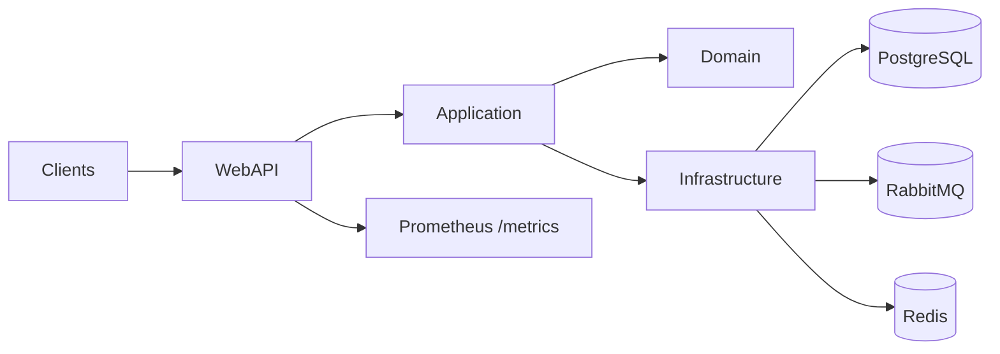

# Architecture

## Clean Architecture Layers
- **Domain**: entities, value objects, domain events, invariants.
- **Application**: CQRS (MediatR) handlers, validators (FluentValidation), mapping (AutoMapper).
- **Infrastructure**: EF Core + Npgsql, Idempotency store, Outbox (EF + background worker), MassTransit/RabbitMQ, Redis, OpenTelemetry exporters.
- **Presentation**: ASP.NET Core WebAPI (Swagger, API Versioning, middlewares).

## Diagrams

### High level

