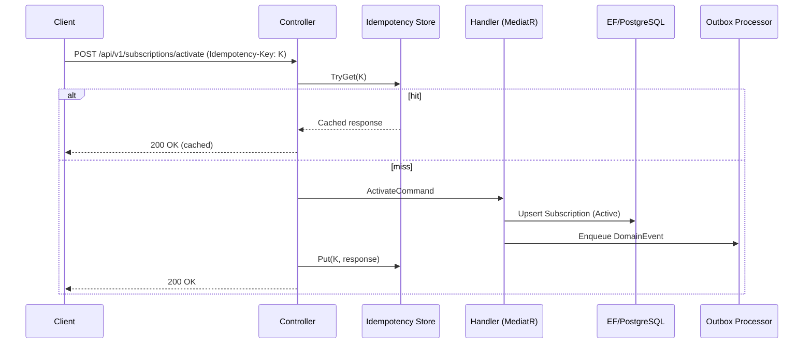

# C4 – Component (Subscription Activate)

```mermaid
sequenceDiagram
  participant C as Client
  participant API as Controller
  participant IDEM as Idempotency Store
  participant APP as Handler (MediatR)
  participant DB as EF/PostgreSQL
  participant OUT as Outbox Processor

  C->>API: POST /api/v1/subscriptions/activate (Idempotency-Key: K)
  API->>IDEM: TryGet(K)
  alt hit
    IDEM-->>API: Cached response
    API-->>C: 200 OK (cached)
  else miss
    API->>APP: ActivateCommand
    APP->>DB: Upsert Subscription (Active)
    APP->>OUT: Enqueue DomainEvent
    API->>IDEM: Put(K, response)
    API-->>C: 200 OK
  end
```
