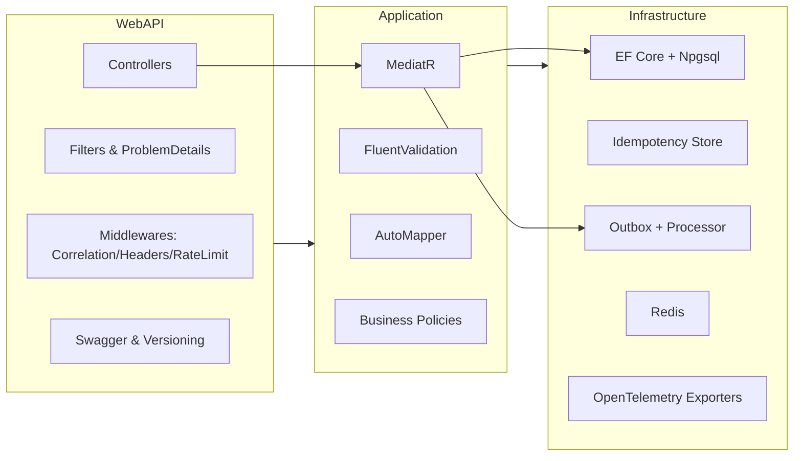

# C4 – Container

```mermaid
flowchart LR
  Controller["Controllers"]
  Filters["Filters & ProblemDetails"]
  Middlewares["Middlewares: Correlation/Headers/RateLimit"]
  Swagger["Swagger & Versioning"]
  Mediator["MediatR"]
  Validators["FluentValidation"]
  Mappers["AutoMapper"]
  Policies["Business Policies"]
  EF["EF Core + Npgsql"]
  Idem["Idempotency Store"]
  Outbox["Outbox + Processor"]
  Cache["Redis"]
  Telemetry["OpenTelemetry Exporters"]
  subgraph WebAPI
    Controller
    Filters
    Middlewares
    Swagger
  end
  subgraph Application
    Mediator
    Validators
    Mappers
    Policies
  end
  subgraph Infrastructure
    EF
    Idem
    Outbox
    Cache
    Telemetry
  end

  Controller --> Mediator
  Mediator --> EF
  Mediator --> Outbox
  WebAPI --> Application
  Application --> Infrastructure
```

