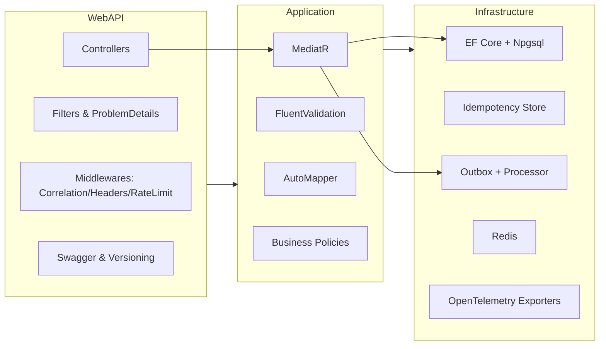

# C4 – Container

```mermaid
flowchart LR
  subgraph WebAPI
    Controller[Controllers]
    Filters[Filters & ProblemDetails]
    Middlewares[Middlewares: Correlation/Headers/RateLimit]
    Swagger[Swagger & Versioning]
  end
  subgraph Application
    Mediator[MediatR]
    Validators[FluentValidation]
    Mappers[AutoMapper]
    Policies[Business Policies]
  end
  subgraph Infrastructure
    EF[EF Core + Npgsql]
    Idem[Idempotency Store]
    Outbox[Outbox + Processor]
    Cache[Redis]
    Telemetry[OpenTelemetry Exporters]
  end

  Controller --> Mediator
  Mediator --> EF
  Mediator --> Outbox
  WebAPI --> Application
  Application --> Infrastructure
```
