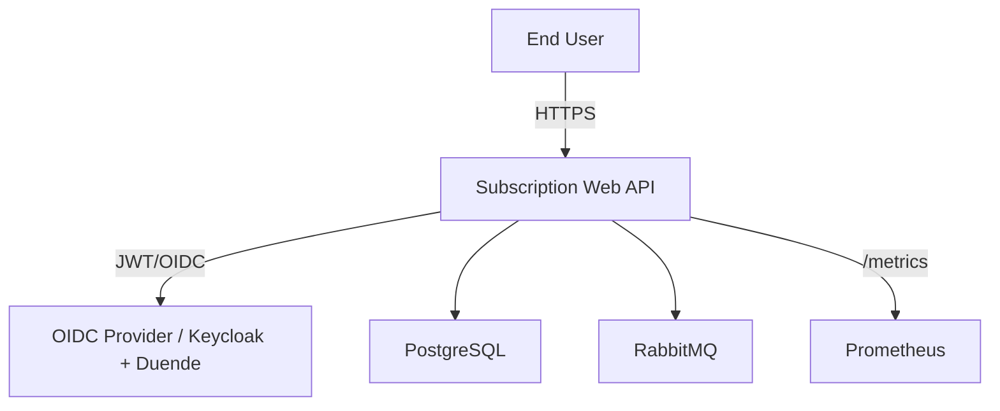

# C4 – System Context

```mermaid
flowchart TB
  user["End User"]
  api["Subscription Web API"]
  idp["OIDC Provider / Keycloak + Duende"]
  db["PostgreSQL"]
  mq["RabbitMQ"]
  metrics["Prometheus"]

  user -- HTTPS --> api
  api -- JWT/OIDC --> idp
  api --> db
  api --> mq
  api -- /metrics --> metrics
```

