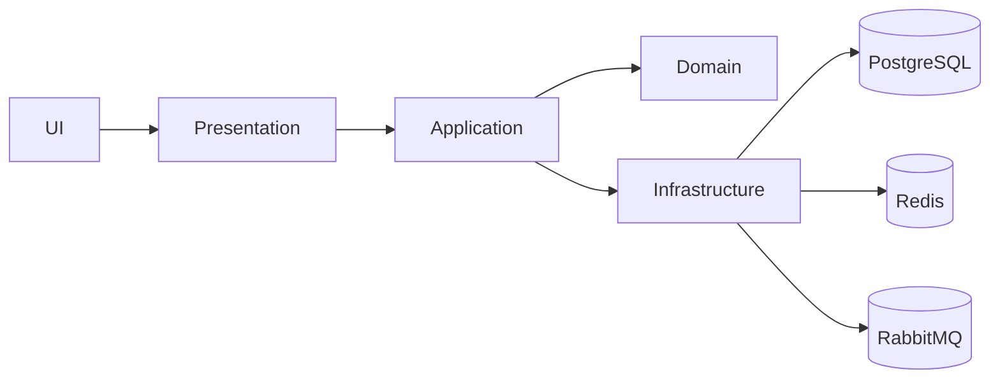

# Clean Architecture

## Layers
- **Domain**: Aggregates, Entities, Value Objects, Domain Events, and invariants.
- **Application**: Use cases via CQRS (MediatR); validation (FluentValidation); projection via AutoMapper.
- **Infrastructure**: EF Core + Npgsql; Idempotency store; Outbox with background processor; Redis; OTEL exporters; bus adapters.
- **Presentation**: ASP.NET Core WebAPI with a hardened middleware pipeline.

## Middleware Order (critical)
1. `UseExceptionHandler` (ProblemDetails)
2. `CorrelationIdMiddleware`
3. `SecurityHeadersMiddleware`
4. `UseRateLimiter`
5. `UseCors`
6. `UseAuthentication`
7. `UseAuthorization`
8. `MapControllers`
