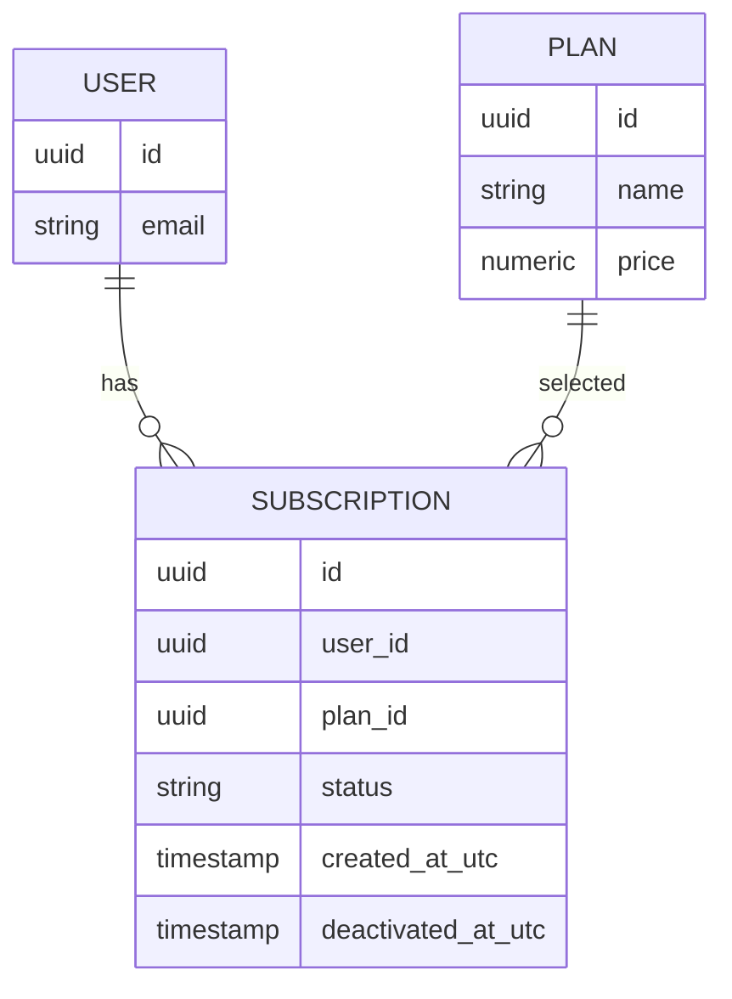

# Domain Model





## Invariants
- **Option A (chosen)**: *User may have at most one Active subscription at a time.*
- DB Enforcement:
```sql
CREATE UNIQUE INDEX IF NOT EXISTS ux_subscriptions_user_active
ON subscriptions (user_id)
WHERE status = 'Active';
```

