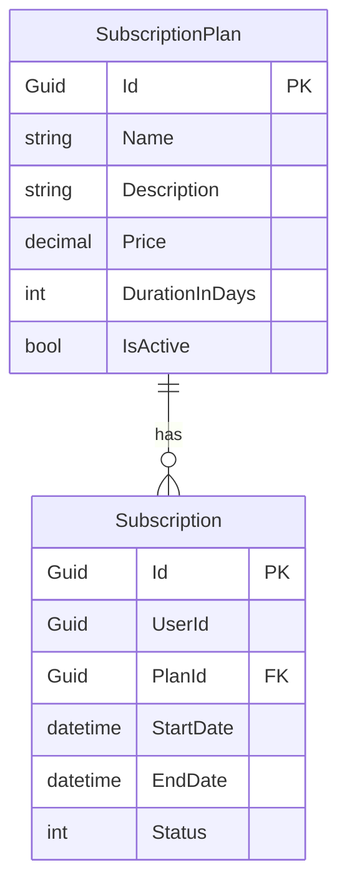
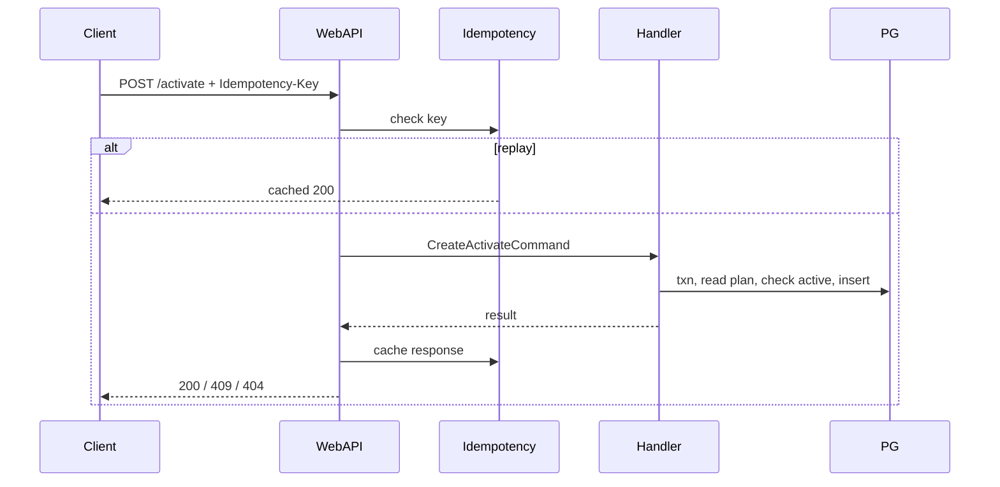
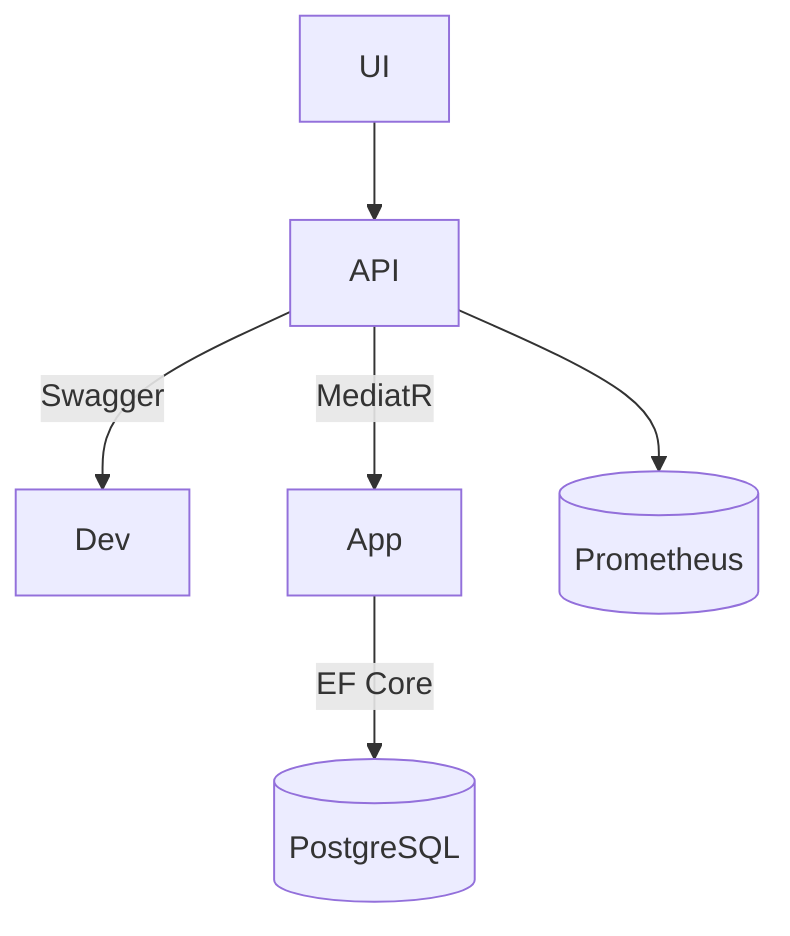

# Diagrams (Mermaid)

## ERD

```mermaid
erDiagram
  SubscriptionPlan ||--o{ Subscription : has
  Subscription {
    Guid Id PK
    Guid UserId
    Guid PlanId FK
    datetime StartDate
    datetime EndDate
    int Status
  }
  SubscriptionPlan {
    Guid Id PK
    string Name
    string Description
    decimal Price
    int DurationInDays
    bool IsActive
  }
```

## Sequence (Activate)

```mermaid
sequenceDiagram
  participant C as Client
  participant API as WebAPI
  participant M as Idempotency
  participant H as Handler
  participant DB as PG
  C->>API: POST /activate + Idempotency-Key
  API->>M: check key
  alt replay
    M-->>C: cached 200
  else
    API->>H: CreateActivateCommand
    H->>DB: txn, read plan, check active, insert
    H-->>API: result
    API->>M: cache response
    API-->>C: 200 / 409 / 404
  end
```

## Components

```mermaid
graph TD
  UI --> API
  API -->|Swagger| Dev
  API -->|MediatR| App
  App -->|EF Core| DB[(PostgreSQL)]
  API --> OTel[(Prometheus)]
```
